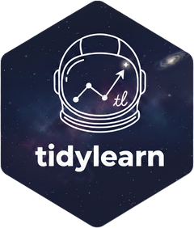

# tidylearn 

Machine Learning for Tidynauts

[](https://cran.r-project.org/package=tidylearn)
[](https://github.com/ces0491/tidylearn/actions/workflows/R-CMD-check.yaml)
[](https://opensource.org/licenses/MIT)

## Overview

`tidylearn` provides a **unified tidyverse-compatible interface** to R's machine
learning ecosystem. It wraps proven packages like glmnet, randomForest,
xgboost, e1071, cluster, and dbscan - you get the reliability of established
implementations with the convenience of a consistent, tidy API.

**What tidylearn does:**

- Reads data from diverse sources (`tl_read()`) — CSV, Excel, Parquet,
  JSON, databases, S3, Kaggle, and more
- Provides one consistent interface (`tl_model()`) to 20 ML algorithms
- Returns tidy tibbles instead of varied output formats
- Offers unified ggplot2-based visualization and formatted `gt` tables
- Enables pipe-friendly workflows with `%>%`
- Orchestrates complex workflows combining multiple techniques

**What tidylearn is NOT:**

- A reimplementation of ML algorithms (uses established packages under the hood)
- A replacement for the underlying packages (you can access the raw model via
  `model$fit`)

## Why tidylearn?

Each ML package in R has its own API, output format, and conventions. tidylearn
provides a translation layer so you can:

| Without tidylearn                     | With tidylearn           |
| ------------------------------------- | -----------------------  |
| Learn different APIs for each package | One API for everything   |
| Write custom code to extract results  | Consistent tibble output |
| Create different plots for each model | Unified visualization    |
| Manage package-specific quirks        | Focus on your analysis   |

The underlying algorithms are unchanged - tidylearn simply makes them easier to
use together.

## Installation

```r
# Install from CRAN
install.packages("tidylearn")

# Or install development version from GitHub
# devtools::install_github("ces0491/tidylearn")
```

## Quick Start

### Data Ingestion

`tl_read()` auto-detects the format and returns a tidy `tidylearn_data` object:

```r
library(tidylearn)

# Single files — format auto-detected from extension
data <- tl_read("sales.csv")
data <- tl_read("results.xlsx", sheet = "Q1")
data <- tl_read("experiment.parquet")

# Databases
data <- tl_read_sqlite("warehouse.sqlite", "SELECT * FROM sales")
data <- tl_read_postgres("localhost", query = "SELECT * FROM customers",
                         dbname = "analytics", user = "me")

# Cloud and API sources
data <- tl_read_s3("s3://my-bucket/data.csv")
data <- tl_read_kaggle("zillow/zecon", file = "Zip_time_series.csv")

# Multi-file reading
data <- tl_read(c("jan.csv", "feb.csv", "mar.csv"))
data <- tl_read_dir("data/monthly/", format = "csv")
data <- tl_read_zip("download.zip")
```

### Unified Interface

A single `tl_model()` function dispatches to the appropriate underlying package:

```r
library(tidylearn)

# Classification -> uses randomForest::randomForest()
model <- tl_model(iris, Species ~ ., method = "forest")

# Regression -> uses stats::lm()
model <- tl_model(mtcars, mpg ~ wt + hp, method = "linear")

# Regularization -> uses glmnet::glmnet()
model <- tl_model(mtcars, mpg ~ ., method = "lasso")

# Clustering -> uses stats::kmeans()
model <- tl_model(iris[,1:4], method = "kmeans", k = 3)

# PCA -> uses stats::prcomp()
model <- tl_model(iris[,1:4], method = "pca")
```

### Tidy Output

All results come back as tibbles, ready for dplyr and ggplot2:

```r
# Predictions come back as a tibble with a .pred column
predictions <- predict(model, new_data = test_data)

# Metrics as tibbles - pick the metrics you want
metrics <- tl_evaluate(model, test_data)
metrics <- tl_evaluate(model, test_data, metrics = c("rmse", "rsq"))

# Easy to pipe
model %>%
  predict(new_data = test_data) %>%
  bind_cols(test_data) %>%
  ggplot(aes(x = mpg, y = .pred)) +
  geom_point() +
  geom_abline(slope = 1, intercept = 0)
```

For classification, what `.pred` holds depends on `type`: `"class"` gives
labels, `"prob"` gives one column per class. The default `"response"` varies
by method - probabilities for logistic regression, labels for trees and
forests - so pass `type` explicitly, or let `tl_evaluate()` handle it.

### Access the Underlying Model

You always have access to the raw model from the underlying package:

```r
model <- tl_model(iris, Species ~ ., method = "forest")

# Access the randomForest object directly
model$fit  # This is the randomForest::randomForest() result

# Use package-specific functions if needed
randomForest::varImpPlot(model$fit)
```

## Wrapped Packages

tidylearn provides a unified interface to these established R packages:

### Supervised Learning

| Method | Underlying Package | Function Called |
| -------- | ------------------- | ----------------- |
| `"linear"` | stats | `lm()` |
| `"polynomial"` | stats | `lm()` with `poly()` |
| `"logistic"` | stats | `glm(..., family = binomial)` |
| `"ridge"`, `"lasso"`, `"elastic_net"` | glmnet | `glmnet()` |
| `"tree"` | rpart | `rpart()` |
| `"forest"` | randomForest | `randomForest()` |
| `"boost"` | gbm | `gbm()` |
| `"xgboost"` | xgboost | `xgb.train()` |
| `"svm"` | e1071 | `svm()` |
| `"nn"` | nnet | `nnet()` |
| `"deep"` | keras | `keras_model_sequential()` |

### Unsupervised Learning

| Method | Underlying Package | Function Called |
| ------ | ------------------ | --------------- |
| `"pca"` | stats | `prcomp()` |
| `"mds"` | stats, MASS, smacof | `cmdscale()`, `isoMDS()`, etc. |
| `"kmeans"` | stats | `kmeans()` |
| `"pam"` | cluster | `pam()` |
| `"clara"` | cluster | `clara()` |
| `"hclust"` | stats | `hclust()` |
| `"dbscan"` | dbscan | `dbscan()` |

## Integration Workflows

Beyond wrapping individual packages, tidylearn provides orchestration functions
that combine multiple techniques:

### Dimensionality Reduction + Supervised Learning

```r
# Reduce dimensions before classification
reduced <- tl_reduce_dimensions(iris, response = "Species",
                                method = "pca", n_components = 3)
model <- tl_model(reduced$data, Species ~ ., method = "forest")
```

### Cluster-Based Feature Engineering

```r
# Add cluster membership as a feature
enriched <- tl_add_cluster_features(data, response = "target",
                                    method = "kmeans", k = 3)
model <- tl_model(enriched, target ~ ., method = "forest")
```

### Semi-Supervised Learning

```r
# Use clustering to propagate labels to unlabeled data
model <- tl_semisupervised(data, target ~ .,
                          labeled_indices = labeled_idx,
                          cluster_method = "kmeans")
```

### AutoML

```r
# Automatically try multiple approaches
result <- tl_auto_ml(data, target ~ .,
                    time_budget = 300)
result$leaderboard
```

## Compute Backends

Most methods run on the CPU and need no thought. For the two with an
upstream GPU path (`"xgboost"` and `"deep"`), `tl_model()` takes a
`compute` argument:

```r
# Check what this machine can actually do
tl_check_gpu()

# Route a fit to the local GPU (falls back to CPU with a warning if
# no CUDA-capable backend is detected)
model <- tl_model(data, y ~ ., method = "xgboost", compute = "gpu")

# Let tidylearn decide per call
model <- tl_model(data, y ~ ., method = "xgboost", compute = "auto")
```

`tl_compute_advisor()` estimates runtime, peak memory and cost across
local CPU, local GPU and cloud tiers before you commit to a long fit:

```r
tl_compute_advisor("xgboost", data, y ~ ., hyperparams = list(nrounds = 5000))
```

Estimates are order-of-magnitude, not quotes. The cloud tier is reported
for planning only - it is not yet executable.

## Unified Visualization

Consistent ggplot2-based plotting regardless of model type:

```r
# Generic plot method works for all model types
plot(forest_model)       # Automatic visualization based on model type
plot(linear_model)       # Diagnostic plots for regression
plot(pca_model)          # Variance explained for PCA
plot(kmeans_model)       # Cluster scatter plot
plot(hclust_model)       # Dendrogram

# The lower-level helpers take data frames rather than models
plot_clusters(cluster_data, cluster_col = "cluster")
plot_variance_explained(pca_model$fit$variance_explained)

# Interactive dashboard for detailed exploration
tl_dashboard(model, test_data)
```

## Formatted Tables

The `tl_table()` family produces polished `gt` tables for reporting:

```r
# Auto-selects the best table type
tl_table(model)

# Specific table types
tl_table_metrics(model, new_data = test_data)
tl_table_coefficients(model)
tl_table_confusion(model, new_data = test_data)
tl_table_importance(model)

# Compare models side-by-side
tl_table_comparison(model1, model2, model3,
                    new_data = test_data,
                    names = c("Linear", "Forest", "XGBoost"))
```

## Philosophy

tidylearn is built on these principles:

1. **Transparency**: The underlying packages do the real work. tidylearn makes
   them easier to use together without hiding what's happening.

2. **Consistency**: One interface, tidy output, unified visualization - across
   all methods.

3. **Accessibility**: Focus on your analysis, not on learning different package
   APIs.

4. **Interoperability**: Results work seamlessly with dplyr, ggplot2, and the
   broader tidyverse.

## Documentation

```r
# View package help
?tidylearn

# Explore main functions
?tl_read
?tl_model
?tl_evaluate
?tl_table
?tl_auto_ml
```

### Vignettes

- **Getting Started** — Overview of the tidylearn workflow
- **Data Ingestion** — Reading from files, databases, and cloud sources
- **Supervised Learning** — Classification and regression
- **Unsupervised Learning** — PCA, clustering, and MDS
- **Reporting** — Plots and formatted tables
- **Integration Workflows** — Combining multiple techniques
- **AutoML** — Automated machine learning

## Contributing

Contributions are welcome. Before opening a PR, please read
[CONTRIBUTING.md](https://github.com/ces0491/tidylearn/blob/main/CONTRIBUTING.md).

## License

MIT License - see [LICENSE](https://github.com/ces0491/tidylearn/blob/main/LICENSE) for details.

## Author

Cesaire Tobias (<cesaire@sheetsolved.com>)

## Acknowledgments

tidylearn is a wrapper that builds upon the excellent work of many R package
authors. The actual algorithms are implemented in:

- **stats** (base R): lm, glm, prcomp, kmeans, hclust, cmdscale
- **glmnet**: Ridge, LASSO, and elastic net regularization
- **randomForest**: Random forest implementation
- **xgboost**: Gradient boosting
- **gbm**: Gradient boosting machines
- **e1071**: Support vector machines
- **nnet**: Neural networks
- **rpart**: Decision trees
- **cluster**: PAM, CLARA clustering
- **dbscan**: Density-based clustering
- **MASS**: Sammon mapping, isoMDS
- **smacof**: SMACOF MDS algorithm
- **keras/tensorflow**: Deep learning (optional)

Thank you to all the package maintainers whose work makes tidylearn possible.

---
