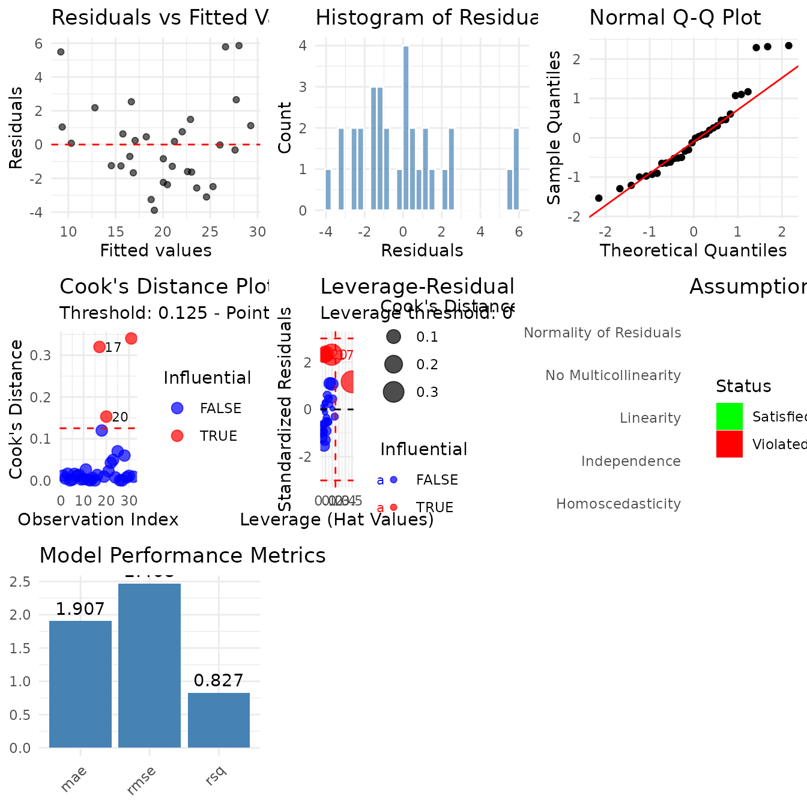
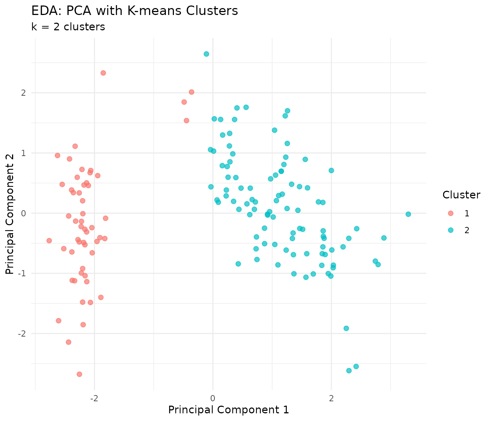

# Diagnostics

``` r

library(tidylearn)
library(dplyr)
#> 
#> Attaching package: 'dplyr'
#> The following objects are masked from 'package:stats':
#> 
#>     filter, lag
#> The following objects are masked from 'package:base':
#> 
#>     intersect, setdiff, setequal, union
```

## Overview

A model that fits is not the same as a model you should use. These
functions answer four questions:

- **Do the assumptions hold?**
  [`tl_check_assumptions()`](https://tidylearn.sheetsolved.com/reference/tl_check_assumptions.md)
- **Which observations drove the fit?**
  [`tl_influence_measures()`](https://tidylearn.sheetsolved.com/reference/tl_influence_measures.md),
  [`tl_detect_outliers()`](https://tidylearn.sheetsolved.com/reference/tl_detect_outliers.md)
- **Is the difference between two models real?**
  [`tl_compare_cv()`](https://tidylearn.sheetsolved.com/reference/tl_compare_cv.md),
  [`tl_test_model_difference()`](https://tidylearn.sheetsolved.com/reference/tl_test_model_difference.md)
- **Are there interactions I have not modelled?**
  [`tl_test_interactions()`](https://tidylearn.sheetsolved.com/reference/tl_test_interactions.md),
  [`tl_interaction_effects()`](https://tidylearn.sheetsolved.com/reference/tl_interaction_effects.md)

[`tl_explore()`](https://tidylearn.sheetsolved.com/reference/tl_explore.md)
runs an unsupervised sweep over a dataset before you model it at all.

We use a linear model throughout, because that is where assumption
checking has teeth.

``` r

model <- tl_model(mtcars, mpg ~ wt + hp + disp, method = "linear")
```

## Checking Assumptions

[`tl_check_assumptions()`](https://tidylearn.sheetsolved.com/reference/tl_check_assumptions.md)
runs six checks and returns a verdict on each.

``` r

assumptions <- tl_check_assumptions(model, verbose = FALSE)
names(assumptions)
#> [1] "linearity"         "independence"      "homoscedasticity" 
#> [4] "normality"         "multicollinearity" "outliers"         
#> [7] "overall"
```

``` r

assumptions$overall
#> $status
#> [1] "5 assumption(s) appear to be violated. See details."
#> 
#> $n_checked
#> [1] 6
#> 
#> $n_violated
#> [1] 5
#> 
#> $n_satisfied
#> [1] 1
```

Each entry carries the test that was run, the verdict, and what to do
about it. Nothing here is a pass/fail gate — the recommendation is a
prompt, not an instruction.

``` r

assumptions$normality
#> $assumption
#> [1] "Normality of Residuals"
#> 
#> $check
#> [1] FALSE
#> 
#> $details
#> [1] "Shapiro-Wilk test p-value: 0.033"
#> 
#> $recommendation
#> [1] "Residuals may not be normally distributed. Consider transformations or robust regression."
```

``` r

assumptions$multicollinearity
#> $assumption
#> [1] "No Multicollinearity"
#> 
#> $check
#> [1] FALSE
#> 
#> $details
#> [1] "Maximum VIF: 7.3245"
#> 
#> $recommendation
#> [1] "Multicollinearity detected. Consider removing or combining highly correlated predictors."
```

A compact table of every check:

``` r

checks <- c("linearity", "independence", "homoscedasticity",
            "normality", "multicollinearity", "outliers")

data.frame(
  assumption = vapply(checks, function(x) assumptions[[x]]$assumption,
                      character(1)),
  holds = vapply(checks, function(x) isTRUE(assumptions[[x]]$check),
                 logical(1)),
  detail = vapply(checks, function(x) assumptions[[x]]$details, character(1)),
  row.names = NULL
)
#>                assumption holds
#> 1               Linearity FALSE
#> 2            Independence FALSE
#> 3        Homoscedasticity  TRUE
#> 4  Normality of Residuals FALSE
#> 5    No Multicollinearity FALSE
#> 6 No Influential Outliers FALSE
#>                                                                detail
#> 1 RESET-style test on powers of the fitted values: p-value = 0.001944
#> 2                                     Durbin-Watson statistic: 1.3673
#> 3                                  Breusch-Pagan test p-value: 0.8143
#> 4                                    Shapiro-Wilk test p-value: 0.033
#> 5                                                 Maximum VIF: 7.3245
#> 6                                 4 influential observations detected
```

`disp` correlating with both `wt` and `hp` is what drives the VIF here,
and it is the kind of thing that is invisible in a coefficient table.

### The dashboard

[`tl_diagnostic_dashboard()`](https://tidylearn.sheetsolved.com/reference/tl_diagnostic_dashboard.md)
draws the standard panels in one grid.

``` r

tl_diagnostic_dashboard(model)
```



    #> TableGrob (3 x 3) "arrange": 7 grobs
    #>                     z     cells    name           grob
    #> residuals_vs_fitted 1 (1-1,1-1) arrange gtable[layout]
    #> residual_hist       2 (1-1,2-2) arrange gtable[layout]
    #> qq_plot             3 (1-1,3-3) arrange gtable[layout]
    #> cook_distance       4 (2-2,1-1) arrange gtable[layout]
    #> leverage_plot       5 (2-2,2-2) arrange gtable[layout]
    #> assumptions         6 (2-2,3-3) arrange gtable[layout]
    #> performance         7 (3-3,1-1) arrange gtable[layout]

Switch off any section you do not want with `include_influence`,
`include_assumptions` or `include_performance`.

## Influence

[`tl_influence_measures()`](https://tidylearn.sheetsolved.com/reference/tl_influence_measures.md)
returns one row per observation with Cook’s distance, leverage, DFFITS,
standardised and studentised residuals, DFBETAS per coefficient, and a
flag for each.

``` r

influence <- tl_influence_measures(model)
dim(influence)
#> [1] 32 15
```

``` r

influence %>%
  filter(is_influential) %>%
  select(observation, cooks_distance, leverage, dffits, std_residual)
#>                   observation cooks_distance   leverage    dffits std_residual
#> Chrysler Imperial          17      0.3199707 0.19279000 1.2354290     2.314921
#> Fiat 128                   18      0.1196019 0.08356445 0.7534560     2.290547
#> Toyota Corolla             20      0.1529771 0.10039528 0.8565855     2.341599
#> Maserati Bora              31      0.3402911 0.49906562 1.1746842     1.168872
```

The flags use conventional cutoffs, which you can override with
`threshold_cook`, `threshold_leverage` and `threshold_dffits`.

The DFBETAS columns say *which coefficient* an observation moved, which
is usually the more useful question:

``` r

influence %>%
  select(observation, starts_with("dfbetas_")) %>%
  arrange(desc(abs(dfbetas_wt))) %>%
  head(4)
#>                   observation dfbetas__Intercept_ dfbetas_wt  dfbetas_hp
#> Chrysler Imperial          17          -0.8449206  0.7354152  0.01567383
#> Lotus Europa               28           0.4079171 -0.3471834  0.07737080
#> Toyota Corolla             20           0.6621570 -0.3090322 -0.18331158
#> Pontiac Firebird           25           0.2415733 -0.3073564 -0.27946896
#>                   dfbetas_disp
#> Chrysler Imperial  -0.22337876
#> Lotus Europa        0.12553686
#> Toyota Corolla      0.08073859
#> Pontiac Firebird    0.46567141
```

### Refit without the influential rows

The point of the exercise is to see whether the conclusion survives.

``` r

keep <- !influence$is_influential
refit <- tl_model(mtcars[keep, ], mpg ~ wt + hp + disp, method = "linear")

data.frame(
  term = names(coef(model$fit)),
  all_rows = round(unname(coef(model$fit)), 4),
  without_influential = round(unname(coef(refit$fit)), 4)
)
#>          term all_rows without_influential
#> 1 (Intercept)  37.1055             37.3163
#> 2          wt  -3.8009             -4.2722
#> 3          hp  -0.0312             -0.0399
#> 4        disp  -0.0009              0.0071
```

``` r

sum(!keep)
#> [1] 4
```

If dropping a handful of rows moves a coefficient materially, that
coefficient describes those rows rather than the population you sampled.

## Outliers in the Data

[`tl_influence_measures()`](https://tidylearn.sheetsolved.com/reference/tl_influence_measures.md)
is about a fitted model.
[`tl_detect_outliers()`](https://tidylearn.sheetsolved.com/reference/tl_detect_outliers.md)
works on the data itself, before or independently of any fit.

``` r

outliers <- tl_detect_outliers(
  mtcars,
  variables = c("mpg", "hp", "wt"),
  method = "iqr",
  plot = FALSE
)

outliers$outlier_counts$total
#> [1] 5
outliers$outlier_counts$by_variable
#> mpg  hp  wt 
#>   1   1   3
```

``` r

mtcars[outliers$outlier_indices, c("mpg", "hp", "wt")]
#>                      mpg  hp    wt
#> Cadillac Fleetwood  10.4 205 5.250
#> Lincoln Continental 10.4 215 5.424
#> Chrysler Imperial   14.7 230 5.345
#> Toyota Corolla      33.9  65 1.835
#> Maserati Bora       15.0 335 3.570
```

`method` also takes `"zscore"` and `"mahalanobis"`. The first two treat
each variable separately; Mahalanobis distance accounts for the
correlation between them, so it finds points that are unremarkable on
every single axis and unusual in combination.

``` r

mahal <- tl_detect_outliers(
  mtcars,
  variables = c("mpg", "hp", "wt"),
  method = "mahalanobis",
  plot = FALSE
)

mahal$outlier_indices
#> [1] 17 31
```

Set `plot = TRUE` to get a ggplot2 object back in `$plot`.

## Comparing Models

A difference in a single held-out score is not evidence.
[`tl_compare_cv()`](https://tidylearn.sheetsolved.com/reference/tl_compare_cv.md)
scores several fitted models over the same folds.

``` r

simple <- tl_model(mtcars, mpg ~ wt, method = "linear")
full <- tl_model(mtcars, mpg ~ wt + hp + disp, method = "linear")
tree <- tl_model(mtcars, mpg ~ wt + hp + disp, method = "tree")

cv <- tl_compare_cv(
  mtcars,
  models = list(simple = simple, full = full, tree = tree),
  folds = 5,
  metrics = c("rmse", "rsq")
)

names(cv)
#> [1] "fold_metrics" "summary"
```

``` r

cv$summary
#> # A tibble: 6 × 6
#>   model  metric mean_value sd_value min_value max_value
#>   <chr>  <chr>       <dbl>    <dbl>     <dbl>     <dbl>
#> 1 full   rmse        2.93     0.708     2.17      3.93 
#> 2 full   rsq         0.612    0.248     0.262     0.859
#> 3 simple rmse        3.09     0.720     1.82      3.59 
#> 4 simple rsq         0.530    0.414    -0.169     0.820
#> 5 tree   rmse        4.42     1.60      2.21      6.58 
#> 6 tree   rsq         0.148    0.527    -0.501     0.767
```

Per-fold scores are kept as well, which is what makes a test possible:

``` r

head(cv$fold_metrics)
#> # A tibble: 6 × 4
#>   metric value  fold model 
#>   <chr>  <dbl> <int> <chr> 
#> 1 rmse   3.35      1 simple
#> 2 rsq    0.820     1 simple
#> 3 rmse   1.82      2 simple
#> 4 rsq    0.808     2 simple
#> 5 rmse   3.29      3 simple
#> 6 rsq    0.481     3 simple
```

### Is the difference real?

[`tl_test_model_difference()`](https://tidylearn.sheetsolved.com/reference/tl_test_model_difference.md)
compares each model against a baseline using the per-fold scores.

``` r

tl_test_model_difference(
  cv,
  baseline_model = "simple",
  metric = "rmse",
  test = "t.test"
)
#>   metric model baseline  mean_diff   p_value     p_adj
#> 1   rmse  full   simple -0.1657558 0.6102364 0.6102364
#> 2   rmse  tree   simple  1.3264236 0.1504542 0.3009083
```

With five folds this has very little power, so treat a non-significant
result as “these folds do not separate the models” rather than as
evidence they are equivalent. `test = "wilcox.test"` drops the normality
assumption, which matters more at small fold counts than the loss of
power costs you.

## Interactions

[`tl_test_interactions()`](https://tidylearn.sheetsolved.com/reference/tl_test_interactions.md)
fits each candidate interaction and reports whether it earns its degrees
of freedom.

``` r

interactions <- tl_test_interactions(
  mtcars, mpg ~ wt + hp + disp,
  all_pairs = TRUE
)

interactions
#>   var1 var2     p_value significant   delta_r2 f_statistic
#> 1   wt   hp 0.000950209        TRUE 0.05845233    13.75810
#> 3   hp disp 0.001238835        TRUE 0.05631176    13.01147
#> 2   wt disp 0.003839687        TRUE 0.04681464    10.00398
```

`delta_r2` is the more useful column: a p-value tells you the term is
detectable, `delta_r2` tells you whether it is worth carrying.

Restrict the search with `numeric_only`, `categorical_only` or
`mixed_only`, or name a single pair with `var1` and `var2`.

### Reading an interaction

Once a term is in the model,
[`tl_interaction_effects()`](https://tidylearn.sheetsolved.com/reference/tl_interaction_effects.md)
says what it does at different levels of the moderator.

``` r

model_int <- tl_model(mtcars, mpg ~ wt * hp, method = "linear")
effects <- tl_interaction_effects(model_int, var = "wt", by_var = "hp")

effects$slopes
#>      by_value by_label     slope     slope_se
#> Q0       52.0       Q0 -6.768521 5.695734e-16
#> Q25      96.5      Q25 -5.529278 4.387243e-16
#> Q50     123.0      Q50 -4.791302 6.071491e-16
#> Q75     180.0      Q75 -3.203958 4.018576e-16
#> Q100    335.0     Q100  1.112505 4.116338e-16
```

The slope of `mpg` on `wt` weakens as `hp` rises — extra weight costs
less fuel economy in a high-powered car, which already had little to
lose.

`slope_se` describes the straight line fitted to the prediction grid
rather than the sampling uncertainty of the marginal effect — for a
linear model the grid is exactly linear, so it is near zero by
construction. Use `summary(model_int$fit)` for inference on the
interaction coefficient.

``` r

summary(model_int$fit)$coefficients
#>                Estimate Std. Error   t value     Pr(>|t|)
#> (Intercept) 49.80842343 3.60515580 13.815887 5.005761e-14
#> wt          -8.21662430 1.26970814 -6.471270 5.199287e-07
#> hp          -0.12010209 0.02469835 -4.862758 4.036243e-05
#> wt:hp        0.02784815 0.00741958  3.753332 8.108307e-04
```

[`tl_auto_interactions()`](https://tidylearn.sheetsolved.com/reference/tl_auto_interactions.md)
does the search and the refit in one step, returning a model with the
surviving interactions already in the formula:

``` r

auto <- tl_auto_interactions(mtcars, mpg ~ wt + hp + disp)
auto$spec$formula
#> mpg ~ wt + hp + disp + wt:hp + hp:disp + wt:disp
```

## Exploring Before Modelling

[`tl_explore()`](https://tidylearn.sheetsolved.com/reference/tl_explore.md)
runs PCA, picks a cluster count, clusters, and computes a distance
summary in one call. It is a first look at a dataset, not a diagnostic
of a fit.

``` r

eda <- tl_explore(iris, response = "Species", max_components = 4, k_range = 2:5)
#> Running Exploratory Data Analysis...
#> [1/4] PCA analysis...
#> [2/4] Finding optimal clusters...
#> [3/4] Clustering analysis...
#> [4/4] Distance analysis...
#> EDA complete!
names(eda)
#> [1] "data"      "response"  "pca"       "optimal_k" "kmeans"    "hclust"   
#> [7] "summary"
```

``` r

eda$optimal_k
#> $k_values
#> [1] 2 3 4 5
#> 
#> $scores
#> [1] 0.6810462 0.5528190 0.4980505 0.4887489
#> 
#> $best_k
#> [1] 2
#> 
#> $best_score
#> [1] 0.6810462
```

``` r

get_pca_variance(eda$pca)
#> # A tibble: 4 × 5
#>   component  sdev variance prop_variance cum_variance
#>   <chr>     <dbl>    <dbl>         <dbl>        <dbl>
#> 1 PC1       1.71    2.92         0.730          0.730
#> 2 PC2       0.956   0.914        0.229          0.958
#> 3 PC3       0.383   0.147        0.0367         0.995
#> 4 PC4       0.144   0.0207       0.00518        1
```

``` r

plot(eda)
```



## A Checklist

For a linear model, in order:

1.  [`tl_check_assumptions()`](https://tidylearn.sheetsolved.com/reference/tl_check_assumptions.md)
    — six checks, with the reason each one failed.
2.  [`tl_influence_measures()`](https://tidylearn.sheetsolved.com/reference/tl_influence_measures.md)
    — refit without the flagged rows and see whether the coefficients
    hold.
3.  [`tl_test_interactions()`](https://tidylearn.sheetsolved.com/reference/tl_test_interactions.md)
    — the effect you assumed was additive may not be.
4.  [`tl_compare_cv()`](https://tidylearn.sheetsolved.com/reference/tl_compare_cv.md)
    then
    [`tl_test_model_difference()`](https://tidylearn.sheetsolved.com/reference/tl_test_model_difference.md)
    — before preferring one model over another.

For tree-based and other non-parametric methods, steps 1 and 3 do not
apply; step 2 is available through
[`tl_detect_outliers()`](https://tidylearn.sheetsolved.com/reference/tl_detect_outliers.md)
on the data, and step 4 works unchanged.
