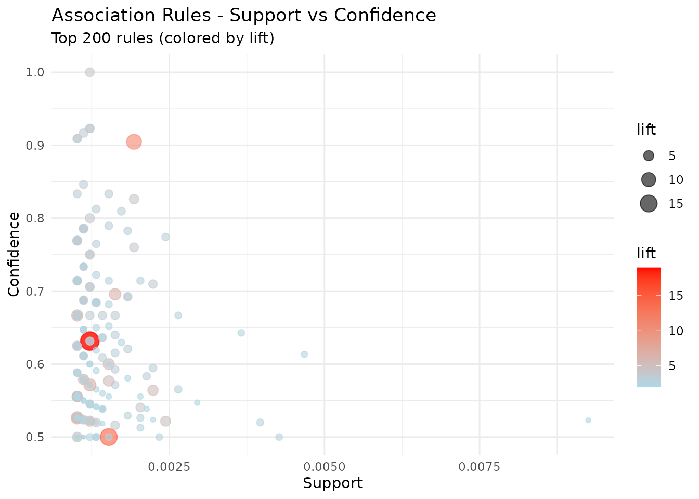
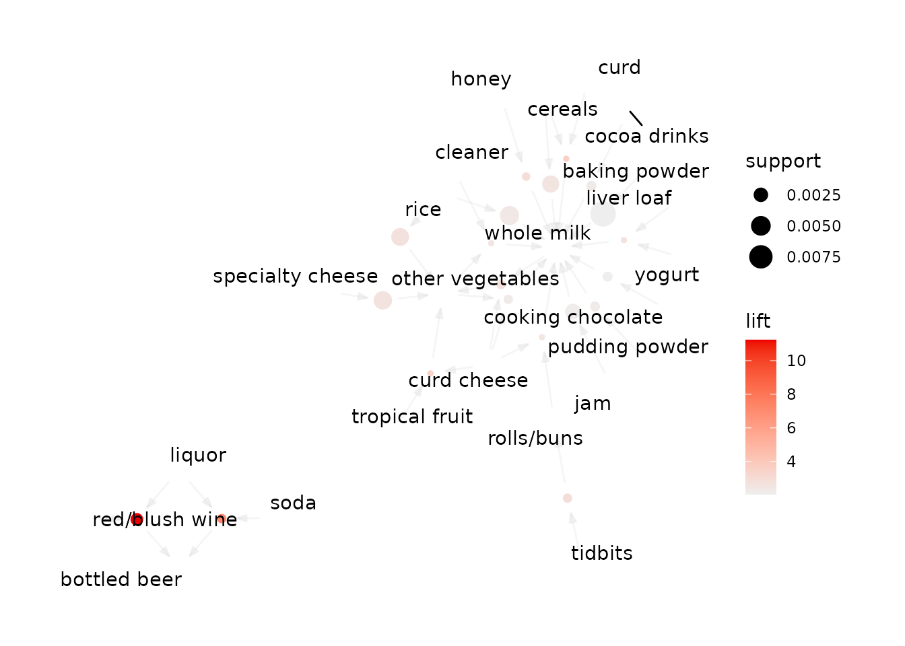

# Market Basket Analysis

``` r

library(tidylearn)
library(dplyr)
```

## Overview

Association rule mining finds statements of the form *when a basket
contains A, it tends to also contain B*. It is unsupervised: there is no
response variable, and every item is a candidate on both sides.

[`tidy_apriori()`](https://tidylearn.sheetsolved.com/reference/tidy_apriori.md)
wraps the Apriori algorithm from
[arules](https://cran.r-project.org/package=arules) and returns the
rules as a tibble instead of an S4 object you have to `inspect()` to
read. The rest of the family filters, ranks and applies those rules.

We use `Groceries`, a month of point-of-sale data from a grocery outlet:
9,835 transactions over 169 item categories.

``` r

data("Groceries", package = "arules")
Groceries
#> transactions in sparse format with
#>  9835 transactions (rows) and
#>  169 items (columns)
```

## Mining Rules

Three numbers describe every rule, and two of them are thresholds you
set up front:

- **Support** — the fraction of all transactions containing the whole
  rule. A support floor is what makes the search tractable, and what
  stops you acting on a pattern that occurred four times.
- **Confidence** — of the baskets containing the left-hand side, the
  fraction that also contain the right-hand side. This is the
  conditional probability.
- **Lift** — confidence divided by the right-hand side’s own frequency.
  Lift of 1 means the two are independent; above 1 means the left-hand
  side makes the right-hand side more likely than chance.

``` r

rules <- tidy_apriori(
  Groceries,
  support = 0.001,      # at least ~10 of the 9,835 transactions
  confidence = 0.5,     # right-hand side follows at least half the time
  minlen = 2            # rules with something on both sides
)
#> Apriori
#> 
#> Parameter specification:
#>  confidence minval smax arem  aval originalSupport maxtime support minlen
#>         0.5    0.1    1 none FALSE            TRUE       5   0.001      2
#>  maxlen target  ext
#>      10  rules TRUE
#> 
#> Algorithmic control:
#>  filter tree heap memopt load sort verbose
#>     0.1 TRUE TRUE  FALSE TRUE    2    TRUE
#> 
#> Absolute minimum support count: 9 
#> 
#> set item appearances ...[0 item(s)] done [0.00s].
#> set transactions ...[169 item(s), 9835 transaction(s)] done [0.00s].
#> sorting and recoding items ... [157 item(s)] done [0.00s].
#> creating transaction tree ... done [0.00s].
#> checking subsets of size 1 2 3 4 5 6 done [0.01s].
#> writing ... [5668 rule(s)] done [0.00s].
#> creating S4 object  ... done [0.00s].
```

``` r

print(rules)
#> Tidy Apriori Results
#> ====================
#> 
#> Parameters:
#>   Minimum support:    0.001 
#>   Minimum confidence: 0.5 
#>   Rule length:        2 - 10 
#> 
#> Results:
#>   Number of rules: 5668 
#> 
#> Quality Measure Summary:
#>   Support:     0.0010 - 0.0223 (mean: 0.0017) 
#>   Confidence:  0.5000 - 1.0000 (mean: 0.6250) 
#>   Lift:        1.96 - 19.00 (mean: 3.26) 
#> 
#> Top 5 rules by lift:
#> # A tibble: 5 × 8
#>   rule_id lhs                      rhs   support confidence coverage  lift count
#>     <int> <chr>                    <chr>   <dbl>      <dbl>    <dbl> <dbl> <int>
#> 1      53 {Instant food products,… {ham… 0.00122      0.632  0.00193  19.0    12
#> 2      37 {soda,popcorn}           {sal… 0.00122      0.632  0.00193  16.7    12
#> 3     444 {flour,baking powder}    {sug… 0.00102      0.556  0.00183  16.4    10
#> 4     327 {ham,processed cheese}   {whi… 0.00193      0.633  0.00305  15.0    19
#> 5      55 {whole milk,Instant foo… {ham… 0.00153      0.5    0.00305  15.0    15
#> 
#> Use inspect_rules() to view more rules
#> Use visualize_rules() to create visualizations
```

The tibble is the part you work with:

``` r

rules$rules_tbl
#> # A tibble: 5,668 × 8
#>    rule_id lhs                 rhs       support confidence coverage  lift count
#>      <int> <chr>               <chr>       <dbl>      <dbl>    <dbl> <dbl> <int>
#>  1       1 {honey}             {whole m… 0.00112      0.733  0.00153  2.87    11
#>  2       2 {tidbits}           {rolls/b… 0.00122      0.522  0.00234  2.84    12
#>  3       3 {cocoa drinks}      {whole m… 0.00132      0.591  0.00224  2.31    13
#>  4       4 {pudding powder}    {whole m… 0.00132      0.565  0.00234  2.21    13
#>  5       5 {cooking chocolate} {whole m… 0.00132      0.52   0.00254  2.04    13
#>  6       6 {cereals}           {whole m… 0.00366      0.643  0.00569  2.52    36
#>  7       7 {jam}               {whole m… 0.00295      0.547  0.00539  2.14    29
#>  8       8 {specialty cheese}  {other v… 0.00427      0.5    0.00854  2.58    42
#>  9       9 {rice}              {other v… 0.00397      0.52   0.00763  2.69    39
#> 10      10 {rice}              {whole m… 0.00468      0.613  0.00763  2.40    46
#> # ℹ 5,658 more rows
```

``` r

names(rules)
#> [1] "rules_tbl"  "rules"      "parameters" "n_rules"
```

`$rules` holds the underlying arules object for anything the tidy layer
does not cover, in the same way `$fit` does for
[`tl_model()`](https://tidylearn.sheetsolved.com/reference/tl_model.md).

### Choosing the thresholds

Support and confidence trade recall against volume, and the trade is
steep.

``` r

grid <- expand.grid(
  support = c(0.001, 0.005, 0.01),
  confidence = c(0.3, 0.5, 0.7)
)

grid$n_rules <- mapply(function(s, c) {
  tidy_apriori(Groceries, support = s, confidence = c)$n_rules
}, grid$support, grid$confidence)
#> Apriori
#> 
#> Parameter specification:
#>  confidence minval smax arem  aval originalSupport maxtime support minlen
#>         0.3    0.1    1 none FALSE            TRUE       5   0.001      2
#>  maxlen target  ext
#>      10  rules TRUE
#> 
#> Algorithmic control:
#>  filter tree heap memopt load sort verbose
#>     0.1 TRUE TRUE  FALSE TRUE    2    TRUE
#> 
#> Absolute minimum support count: 9 
#> 
#> set item appearances ...[0 item(s)] done [0.00s].
#> set transactions ...[169 item(s), 9835 transaction(s)] done [0.00s].
#> sorting and recoding items ... [157 item(s)] done [0.00s].
#> creating transaction tree ... done [0.00s].
#> checking subsets of size 1 2 3 4 5 6 done [0.01s].
#> writing ... [13770 rule(s)] done [0.00s].
#> creating S4 object  ... done [0.00s].
#> Apriori
#> 
#> Parameter specification:
#>  confidence minval smax arem  aval originalSupport maxtime support minlen
#>         0.3    0.1    1 none FALSE            TRUE       5   0.005      2
#>  maxlen target  ext
#>      10  rules TRUE
#> 
#> Algorithmic control:
#>  filter tree heap memopt load sort verbose
#>     0.1 TRUE TRUE  FALSE TRUE    2    TRUE
#> 
#> Absolute minimum support count: 49 
#> 
#> set item appearances ...[0 item(s)] done [0.00s].
#> set transactions ...[169 item(s), 9835 transaction(s)] done [0.00s].
#> sorting and recoding items ... [120 item(s)] done [0.00s].
#> creating transaction tree ... done [0.00s].
#> checking subsets of size 1 2 3 4 done [0.00s].
#> writing ... [482 rule(s)] done [0.00s].
#> creating S4 object  ... done [0.00s].
#> Apriori
#> 
#> Parameter specification:
#>  confidence minval smax arem  aval originalSupport maxtime support minlen
#>         0.3    0.1    1 none FALSE            TRUE       5    0.01      2
#>  maxlen target  ext
#>      10  rules TRUE
#> 
#> Algorithmic control:
#>  filter tree heap memopt load sort verbose
#>     0.1 TRUE TRUE  FALSE TRUE    2    TRUE
#> 
#> Absolute minimum support count: 98 
#> 
#> set item appearances ...[0 item(s)] done [0.00s].
#> set transactions ...[169 item(s), 9835 transaction(s)] done [0.00s].
#> sorting and recoding items ... [88 item(s)] done [0.00s].
#> creating transaction tree ... done [0.00s].
#> checking subsets of size 1 2 3 4 done [0.00s].
#> writing ... [125 rule(s)] done [0.00s].
#> creating S4 object  ... done [0.00s].
#> Apriori
#> 
#> Parameter specification:
#>  confidence minval smax arem  aval originalSupport maxtime support minlen
#>         0.5    0.1    1 none FALSE            TRUE       5   0.001      2
#>  maxlen target  ext
#>      10  rules TRUE
#> 
#> Algorithmic control:
#>  filter tree heap memopt load sort verbose
#>     0.1 TRUE TRUE  FALSE TRUE    2    TRUE
#> 
#> Absolute minimum support count: 9 
#> 
#> set item appearances ...[0 item(s)] done [0.00s].
#> set transactions ...[169 item(s), 9835 transaction(s)] done [0.00s].
#> sorting and recoding items ... [157 item(s)] done [0.00s].
#> creating transaction tree ... done [0.00s].
#> checking subsets of size 1 2 3 4 5 6 done [0.01s].
#> writing ... [5668 rule(s)] done [0.00s].
#> creating S4 object  ... done [0.00s].
#> Apriori
#> 
#> Parameter specification:
#>  confidence minval smax arem  aval originalSupport maxtime support minlen
#>         0.5    0.1    1 none FALSE            TRUE       5   0.005      2
#>  maxlen target  ext
#>      10  rules TRUE
#> 
#> Algorithmic control:
#>  filter tree heap memopt load sort verbose
#>     0.1 TRUE TRUE  FALSE TRUE    2    TRUE
#> 
#> Absolute minimum support count: 49 
#> 
#> set item appearances ...[0 item(s)] done [0.00s].
#> set transactions ...[169 item(s), 9835 transaction(s)] done [0.00s].
#> sorting and recoding items ... [120 item(s)] done [0.00s].
#> creating transaction tree ... done [0.00s].
#> checking subsets of size 1 2 3 4 done [0.00s].
#> writing ... [120 rule(s)] done [0.00s].
#> creating S4 object  ... done [0.00s].
#> Apriori
#> 
#> Parameter specification:
#>  confidence minval smax arem  aval originalSupport maxtime support minlen
#>         0.5    0.1    1 none FALSE            TRUE       5    0.01      2
#>  maxlen target  ext
#>      10  rules TRUE
#> 
#> Algorithmic control:
#>  filter tree heap memopt load sort verbose
#>     0.1 TRUE TRUE  FALSE TRUE    2    TRUE
#> 
#> Absolute minimum support count: 98 
#> 
#> set item appearances ...[0 item(s)] done [0.00s].
#> set transactions ...[169 item(s), 9835 transaction(s)] done [0.00s].
#> sorting and recoding items ... [88 item(s)] done [0.00s].
#> creating transaction tree ... done [0.00s].
#> checking subsets of size 1 2 3 4 done [0.00s].
#> writing ... [15 rule(s)] done [0.00s].
#> creating S4 object  ... done [0.00s].
#> Apriori
#> 
#> Parameter specification:
#>  confidence minval smax arem  aval originalSupport maxtime support minlen
#>         0.7    0.1    1 none FALSE            TRUE       5   0.001      2
#>  maxlen target  ext
#>      10  rules TRUE
#> 
#> Algorithmic control:
#>  filter tree heap memopt load sort verbose
#>     0.1 TRUE TRUE  FALSE TRUE    2    TRUE
#> 
#> Absolute minimum support count: 9 
#> 
#> set item appearances ...[0 item(s)] done [0.00s].
#> set transactions ...[169 item(s), 9835 transaction(s)] done [0.00s].
#> sorting and recoding items ... [157 item(s)] done [0.00s].
#> creating transaction tree ... done [0.00s].
#> checking subsets of size 1 2 3 4 5 6 done [0.01s].
#> writing ... [1279 rule(s)] done [0.00s].
#> creating S4 object  ... done [0.00s].
#> Apriori
#> 
#> Parameter specification:
#>  confidence minval smax arem  aval originalSupport maxtime support minlen
#>         0.7    0.1    1 none FALSE            TRUE       5   0.005      2
#>  maxlen target  ext
#>      10  rules TRUE
#> 
#> Algorithmic control:
#>  filter tree heap memopt load sort verbose
#>     0.1 TRUE TRUE  FALSE TRUE    2    TRUE
#> 
#> Absolute minimum support count: 49 
#> 
#> set item appearances ...[0 item(s)] done [0.00s].
#> set transactions ...[169 item(s), 9835 transaction(s)] done [0.00s].
#> sorting and recoding items ... [120 item(s)] done [0.00s].
#> creating transaction tree ... done [0.00s].
#> checking subsets of size 1 2 3 4 done [0.00s].
#> writing ... [1 rule(s)] done [0.00s].
#> creating S4 object  ... done [0.00s].
#> Apriori
#> 
#> Parameter specification:
#>  confidence minval smax arem  aval originalSupport maxtime support minlen
#>         0.7    0.1    1 none FALSE            TRUE       5    0.01      2
#>  maxlen target  ext
#>      10  rules TRUE
#> 
#> Algorithmic control:
#>  filter tree heap memopt load sort verbose
#>     0.1 TRUE TRUE  FALSE TRUE    2    TRUE
#> 
#> Absolute minimum support count: 98 
#> 
#> set item appearances ...[0 item(s)] done [0.00s].
#> set transactions ...[169 item(s), 9835 transaction(s)] done [0.00s].
#> sorting and recoding items ... [88 item(s)] done [0.00s].
#> creating transaction tree ... done [0.00s].
#> checking subsets of size 1 2 3 4 done [0.00s].
#> writing ... [0 rule(s)] done [0.00s].
#> creating S4 object  ... done [0.00s].

grid
#>   support confidence n_rules
#> 1   0.001        0.3   13770
#> 2   0.005        0.3     482
#> 3   0.010        0.3     125
#> 4   0.001        0.5    5668
#> 5   0.005        0.5     120
#> 6   0.010        0.5      15
#> 7   0.001        0.7    1279
#> 8   0.005        0.7       1
#> 9   0.010        0.7       0
```

Dropping the support floor by a factor of ten multiplies the rule count
by more than a hundred. A high-confidence rule at very low support is
usually a description of a handful of shoppers, not of the shop.

## Reading the Rules

[`inspect_rules()`](https://tidylearn.sheetsolved.com/reference/inspect_rules.md)
sorts and takes the head, which is what you want almost every time:

``` r

inspect_rules(rules, by = "lift", n = 10)
#> # A tibble: 10 × 8
#>    rule_id lhs                     rhs   support confidence coverage  lift count
#>      <int> <chr>                   <chr>   <dbl>      <dbl>    <dbl> <dbl> <int>
#>  1      53 {Instant food products… {ham… 0.00122      0.632  0.00193  19.0    12
#>  2      37 {soda,popcorn}          {sal… 0.00122      0.632  0.00193  16.7    12
#>  3     444 {flour,baking powder}   {sug… 0.00102      0.556  0.00183  16.4    10
#>  4     327 {ham,processed cheese}  {whi… 0.00193      0.633  0.00305  15.0    19
#>  5      55 {whole milk,Instant fo… {ham… 0.00153      0.5    0.00305  15.0    15
#>  6    4807 {other vegetables,curd… {cre… 0.00102      0.588  0.00173  14.8    10
#>  7     330 {processed cheese,dome… {whi… 0.00112      0.524  0.00214  12.4    11
#>  8    4858 {tropical fruit,other … {but… 0.00102      0.667  0.00153  12.0    10
#>  9    2261 {hamburger meat,yogurt… {but… 0.00102      0.625  0.00163  11.3    10
#> 10    5638 {tropical fruit,other … {but… 0.00102      0.625  0.00163  11.3    10
```

`by` also accepts `"support"`, `"confidence"` and `"count"`. Set
`decreasing = FALSE` to look at the other end.

[`summarize_rules()`](https://tidylearn.sheetsolved.com/reference/summarize_rules.md)
gives the distribution of each quality measure across the whole rule
set:

``` r

summary_stats <- summarize_rules(rules)
summary_stats$n_rules
#> [1] 5668
```

``` r

data.frame(
  measure = c("support", "confidence", "lift"),
  min = c(summary_stats$support$min, summary_stats$confidence$min,
          summary_stats$lift$min),
  median = c(summary_stats$support$median, summary_stats$confidence$median,
             summary_stats$lift$median),
  max = c(summary_stats$support$max, summary_stats$confidence$max,
          summary_stats$lift$max)
)
#>      measure         min     median         max
#> 1    support 0.001016777 0.00132181  0.02226741
#> 2 confidence 0.500000000 0.60000000  1.00000000
#> 3       lift 1.956824513 2.89899928 18.99565427
```

Because the result is a tibble, dplyr works directly:

``` r

rules$rules_tbl %>%
  filter(lift > 5, count >= 15) %>%
  arrange(desc(confidence)) %>%
  select(lhs, rhs, confidence, lift, count)
#> # A tibble: 70 × 5
#>    lhs                                              rhs   confidence  lift count
#>    <chr>                                            <chr>      <dbl> <dbl> <int>
#>  1 {liquor,red/blush wine}                          {bot…      0.905 11.2     19
#>  2 {tropical fruit,butter,curd}                     {yog…      0.789  5.66    15
#>  3 {tropical fruit,whole milk,rolls/buns,pastry}    {yog…      0.789  5.66    15
#>  4 {tropical fruit,whole milk,soft cheese}          {yog…      0.714  5.12    15
#>  5 {root vegetables,whipped/sour cream,cream chees… {yog…      0.714  5.12    15
#>  6 {tropical fruit,whipped/sour cream,margarine}    {yog…      0.714  5.12    15
#>  7 {sausage,root vegetables,whipped/sour cream}     {yog…      0.714  5.12    15
#>  8 {tropical fruit,whole milk,whipped/sour cream,r… {yog…      0.714  5.12    15
#>  9 {tropical fruit,root vegetables,whole milk,butt… {yog…      0.708  5.08    17
#> 10 {tropical fruit,whole milk,coffee}               {yog…      0.704  5.04    19
#> # ℹ 60 more rows
```

## Working With One Item

[`filter_rules_by_item()`](https://tidylearn.sheetsolved.com/reference/filter_rules_by_item.md)
narrows to rules mentioning an item. `where` picks the side: `"lhs"` for
what the item leads to, `"rhs"` for what leads to it, `"both"` for
either.

``` r

# What predicts a purchase of whole milk?
filter_rules_by_item(rules, "whole milk", where = "rhs") %>%
  arrange(desc(lift)) %>%
  select(lhs, confidence, lift, count) %>%
  head(5)
#> # A tibble: 5 × 4
#>   lhs                                        confidence  lift count
#>   <chr>                                           <dbl> <dbl> <int>
#> 1 {rice,sugar}                                        1  3.91    12
#> 2 {canned fish,hygiene articles}                      1  3.91    11
#> 3 {root vegetables,butter,rice}                       1  3.91    10
#> 4 {root vegetables,whipped/sour cream,flour}          1  3.91    17
#> 5 {butter,soft cheese,domestic eggs}                  1  3.91    10
```

``` r

# And what does a basket containing yoghurt lead to?
filter_rules_by_item(rules, "yogurt", where = "lhs") %>%
  arrange(desc(lift)) %>%
  select(lhs, rhs, confidence, lift) %>%
  head(5)
#> # A tibble: 5 × 4
#>   lhs                                                     rhs   confidence  lift
#>   <chr>                                                   <chr>      <dbl> <dbl>
#> 1 {other vegetables,curd,yogurt,whipped/sour cream}       {cre…      0.588  14.8
#> 2 {tropical fruit,other vegetables,yogurt,white bread}    {but…      0.667  12.0
#> 3 {hamburger meat,yogurt,whipped/sour cream}              {but…      0.625  11.3
#> 4 {tropical fruit,other vegetables,whole milk,yogurt,dom… {but…      0.625  11.3
#> 5 {other vegetables,yogurt,whipped/sour cream,cream chee… {cur…      0.588  11.0
```

[`find_related_items()`](https://tidylearn.sheetsolved.com/reference/find_related_items.md)
is the shortcut for the common question, with a lift floor built in so
that co-occurrence by sheer popularity is excluded:

``` r

find_related_items(rules, "yogurt", min_lift = 1.5, top_n = 5) %>%
  select(lhs, rhs, confidence, lift)
#> # A tibble: 5 × 4
#>   lhs                                                     rhs   confidence  lift
#>   <chr>                                                   <chr>      <dbl> <dbl>
#> 1 {other vegetables,curd,yogurt,whipped/sour cream}       {cre…      0.588  14.8
#> 2 {tropical fruit,other vegetables,yogurt,white bread}    {but…      0.667  12.0
#> 3 {hamburger meat,yogurt,whipped/sour cream}              {but…      0.625  11.3
#> 4 {tropical fruit,other vegetables,whole milk,yogurt,dom… {but…      0.625  11.3
#> 5 {other vegetables,yogurt,whipped/sour cream,cream chee… {cur…      0.588  11.0
```

## Recommending From a Basket

[`recommend_products()`](https://tidylearn.sheetsolved.com/reference/recommend_products.md)
takes the items currently in a basket and returns what the rules suggest
adding.

``` r

recommend_products(
  rules,
  basket = c("flour", "baking powder"),
  top_n = 5
)
#> # A tibble: 2 × 4
#>   rhs          confidence  lift support
#>   <chr>             <dbl> <dbl>   <dbl>
#> 1 {sugar}           0.556 16.4  0.00102
#> 2 {whole milk}      0.523  2.05 0.00925
```

A rule only fires when the basket covers its **entire** left-hand side,
so a basket of one or two very common items often matches nothing above
the confidence floor:

``` r

recommend_products(rules, basket = c("whole milk", "butter"))
#> # A tibble: 0 × 4
#> # ℹ 4 variables: rhs <chr>, confidence <dbl>, lift <dbl>, support <dbl>
```

That empty result is the honest answer rather than a failure.
`whole milk` appears in about a quarter of all baskets, so very little
follows it with 50% confidence.

`min_confidence` filters the rules you already mined, so raising the
ceiling means re-mining, not re-filtering. `rules` above was mined at
`confidence = 0.5`, and no amount of filtering will produce a rule that
was never generated:

``` r

broad <- tidy_apriori(
  Groceries,
  support = 0.001, confidence = 0.15, minlen = 2
)
#> Apriori
#> 
#> Parameter specification:
#>  confidence minval smax arem  aval originalSupport maxtime support minlen
#>        0.15    0.1    1 none FALSE            TRUE       5   0.001      2
#>  maxlen target  ext
#>      10  rules TRUE
#> 
#> Algorithmic control:
#>  filter tree heap memopt load sort verbose
#>     0.1 TRUE TRUE  FALSE TRUE    2    TRUE
#> 
#> Absolute minimum support count: 9 
#> 
#> set item appearances ...[0 item(s)] done [0.00s].
#> set transactions ...[169 item(s), 9835 transaction(s)] done [0.00s].
#> sorting and recoding items ... [157 item(s)] done [0.00s].
#> creating transaction tree ... done [0.00s].
#> checking subsets of size 1 2 3 4 5 6 done [0.01s].
#> writing ... [26820 rule(s)] done [0.00s].
#> creating S4 object  ... done [0.00s].

broad$n_rules
#> [1] 26820
```

``` r

recommend_products(
  broad,
  basket = c("whole milk", "butter"),
  min_confidence = 0.15,
  top_n = 5
)
#> # A tibble: 5 × 4
#>   rhs                  confidence  lift support
#>   <chr>                     <dbl> <dbl>   <dbl>
#> 1 {domestic eggs}           0.218  3.43 0.00600
#> 2 {whipped/sour cream}      0.244  3.40 0.00671
#> 3 {curd}                    0.177  3.32 0.00488
#> 4 {domestic eggs}           0.174  2.75 0.00966
#> 5 {root vegetables}         0.299  2.74 0.00824
```

Confidence around 0.2 is weak on its own — one basket in five. Lift near
3.4 is what makes these worth reading: eggs are three times more likely
in a basket that already holds milk and butter than in a basket picked
at random. For common items, mine wide and rank on lift.

## Visualising

[`visualize_rules()`](https://tidylearn.sheetsolved.com/reference/visualize_rules.md)
returns a ggplot2 object for the scatter method, so it composes like any
other plot in the package.

``` r

visualize_rules(rules, method = "scatter", top_n = 200)
```



Support on one axis against confidence on the other, coloured by lift,
is the standard first look. Rules sitting well away from the main cloud
are the ones to read.

``` r

visualize_rules(rules, method = "graph", top_n = 20)
```



The graph method needs arulesViz and draws items as nodes with rules as
edges, which is the more useful view once you have narrowed to a handful
of rules worth reading.

## From a Data Frame

`Groceries` is already a `transactions` object. Real data usually
arrives as one row per line item, which `arules` coerces:

``` r

receipts <- data.frame(
  basket_id = c(1, 1, 1, 2, 2, 3, 3, 3, 4, 4, 5, 5, 5),
  item = c("bread", "butter", "jam",
           "bread", "butter",
           "bread", "butter", "jam",
           "milk", "bread",
           "bread", "butter", "jam"),
  stringsAsFactors = TRUE
)

baskets <- split(as.character(receipts$item), receipts$basket_id)
transactions <- as(baskets, "transactions")
transactions
#> transactions in sparse format with
#>  5 transactions (rows) and
#>  4 items (columns)
```

``` r

small_rules <- tidy_apriori(
  transactions,
  support = 0.4, confidence = 0.6, minlen = 2
)
#> Apriori
#> 
#> Parameter specification:
#>  confidence minval smax arem  aval originalSupport maxtime support minlen
#>         0.6    0.1    1 none FALSE            TRUE       5     0.4      2
#>  maxlen target  ext
#>      10  rules TRUE
#> 
#> Algorithmic control:
#>  filter tree heap memopt load sort verbose
#>     0.1 TRUE TRUE  FALSE TRUE    2    TRUE
#> 
#> Absolute minimum support count: 2 
#> 
#> set item appearances ...[0 item(s)] done [0.00s].
#> set transactions ...[4 item(s), 5 transaction(s)] done [0.00s].
#> sorting and recoding items ... [3 item(s)] done [0.00s].
#> creating transaction tree ... done [0.00s].
#> checking subsets of size 1 2 3 done [0.00s].
#> writing ... [9 rule(s)] done [0.00s].
#> creating S4 object  ... done [0.00s].

small_rules$rules_tbl %>%
  arrange(desc(lift)) %>%
  select(lhs, rhs, support, confidence, lift)
#> # A tibble: 9 × 5
#>   lhs            rhs      support confidence  lift
#>   <chr>          <chr>      <dbl>      <dbl> <dbl>
#> 1 {jam}          {butter}     0.6       1     1.25
#> 2 {butter}       {jam}        0.6       0.75  1.25
#> 3 {bread,jam}    {butter}     0.6       1     1.25
#> 4 {bread,butter} {jam}        0.6       0.75  1.25
#> 5 {jam}          {bread}      0.6       1     1   
#> 6 {bread}        {jam}        0.6       0.6   1   
#> 7 {butter}       {bread}      0.8       1     1   
#> 8 {bread}        {butter}     0.8       0.8   1   
#> 9 {butter,jam}   {bread}      0.6       1     1
```

With five baskets these numbers mean nothing — the point is the shape of
the input. Anything `arules` accepts as `transactions`,
[`tidy_apriori()`](https://tidylearn.sheetsolved.com/reference/tidy_apriori.md)
accepts.

## What the Numbers Do Not Tell You

Three cautions worth carrying:

1.  **Lift is symmetric; the rule is not.** *A ⇒ B* and *B ⇒ A* have the
    same lift and usually different confidence. Which direction you act
    on is a decision about the business, not a result from the data.
2.  **A rule is not a cause.** Bread and butter co-occur because people
    buy both, not because one drives the other. Moving butter next to
    bread is a testable hypothesis, and the test is an experiment.
3.  **Rules describe the period you mined.** A month of grocery data
    carries that month’s seasonality. Re-mine rather than reusing a
    stored rule set across a season boundary.

## Function Reference

| Function | Purpose |
|----|----|
| [`tidy_apriori()`](https://tidylearn.sheetsolved.com/reference/tidy_apriori.md) | Mine rules, return a tibble |
| [`tidy_rules()`](https://tidylearn.sheetsolved.com/reference/tidy_rules.md) | Convert an arules rules object to a tibble |
| [`inspect_rules()`](https://tidylearn.sheetsolved.com/reference/inspect_rules.md) | Sort by a quality measure and take the head |
| [`summarize_rules()`](https://tidylearn.sheetsolved.com/reference/summarize_rules.md) | Distribution of support, confidence and lift |
| [`filter_rules_by_item()`](https://tidylearn.sheetsolved.com/reference/filter_rules_by_item.md) | Rules mentioning an item, by side |
| [`find_related_items()`](https://tidylearn.sheetsolved.com/reference/find_related_items.md) | Items associated with one item, above a lift floor |
| [`recommend_products()`](https://tidylearn.sheetsolved.com/reference/recommend_products.md) | Suggestions for a given basket |
| [`visualize_rules()`](https://tidylearn.sheetsolved.com/reference/visualize_rules.md) | Scatter, graph and grouped-matrix plots |
