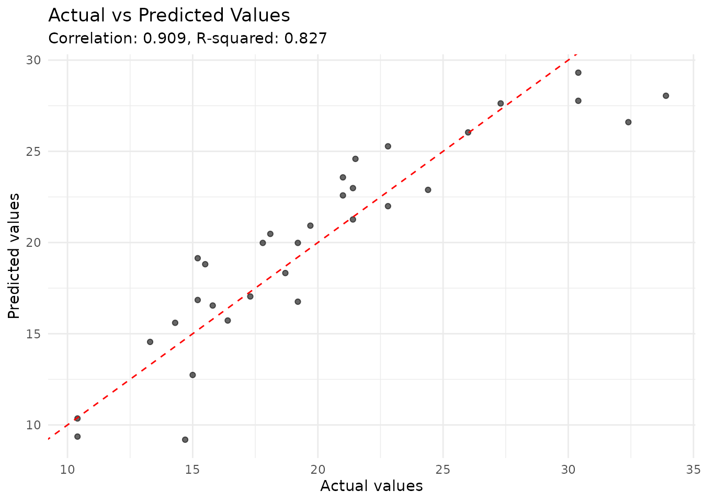
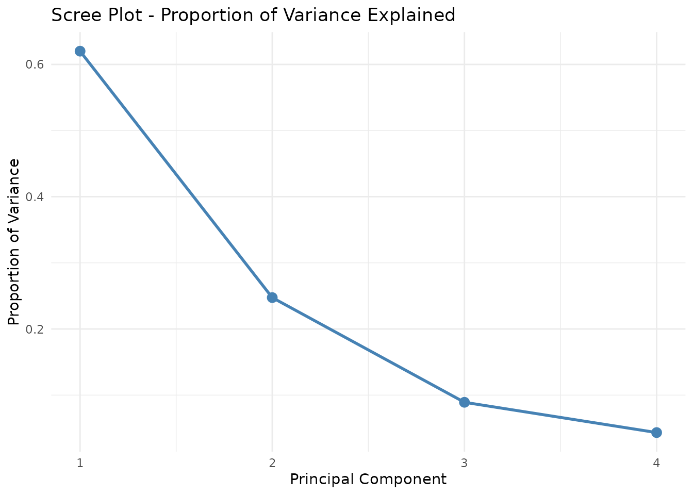
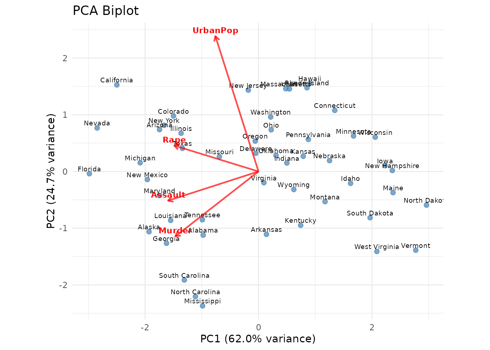
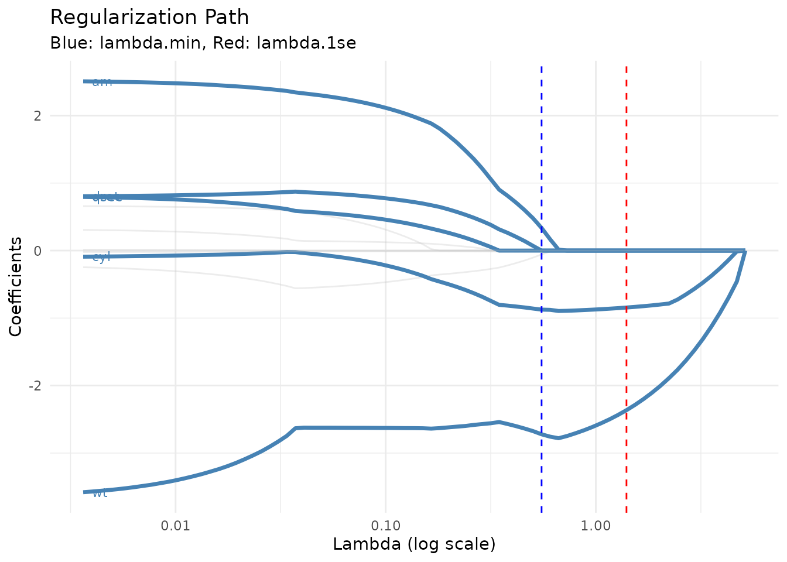
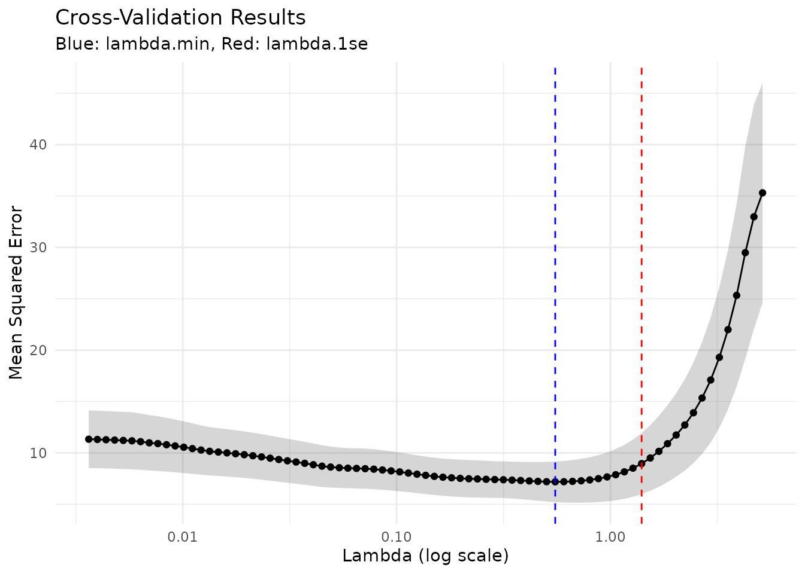
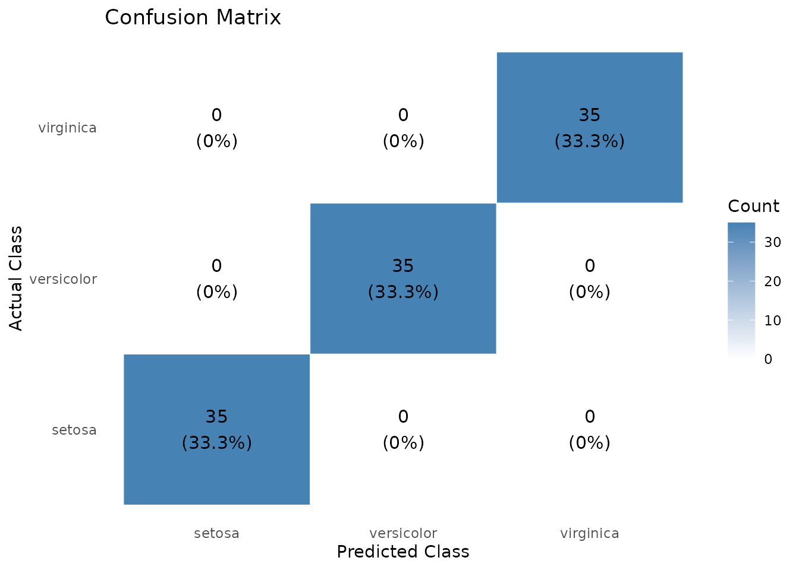

# Reporting with tidylearn

## Overview

tidylearn is designed so that analysis results flow directly into
reports. Every model produces tidy tibbles, ggplot2 visualisations, and
— with the `tl_table_*()` functions — formatted `gt` tables, all with a
consistent interface. This vignette walks through the reporting tools
available.

``` r

library(tidylearn)
library(dplyr)
library(ggplot2)
library(gt)
```

------------------------------------------------------------------------

## Plots

tidylearn’s [`plot()`](https://rdrr.io/r/graphics/plot.default.html)
method dispatches to the right visualisation for each model type. All
plots are ggplot2 objects — themeable, composable, and convertible to
plotly.

### Regression

``` r

model_reg <- tl_model(mtcars, mpg ~ wt + hp, method = "linear")

# Actual vs predicted — one call
plot(model_reg, type = "actual_predicted")
```



### Classification

``` r

split <- tl_split(iris, prop = 0.7, stratify = "Species", seed = 42)
model_clf <- tl_model(split$train, Species ~ ., method = "forest")

plot(model_clf, type = "confusion")
```


### PCA

``` r

pca <- tidy_pca(USArrests, scale = TRUE)

tidy_pca_screeplot(pca)
```



``` r

tidy_pca_biplot(pca, label_obs = TRUE)
```



### Regularisation

``` r

model_lasso <- tl_model(mtcars, mpg ~ ., method = "lasso")

tl_plot_regularization_path(model_lasso)
```



``` r

tl_plot_regularization_cv(model_lasso)
```



------------------------------------------------------------------------

## Tables

The
[`tl_table()`](https://tidylearn.sheetsolved.com/reference/tl_table.md)
family mirrors the plot interface but produces formatted `gt` tables
instead. Like [`plot()`](https://rdrr.io/r/graphics/plot.default.html),
[`tl_table()`](https://tidylearn.sheetsolved.com/reference/tl_table.md)
dispatches based on model type and a `type` parameter:

``` r

tl_table(model)                       # auto-selects the best table type
tl_table(model, type = "coefficients") # specific type
```

### Evaluation Metrics

``` r

tl_table_metrics(model_reg)
```

| Model Evaluation Metrics                                    |        |
|-------------------------------------------------------------|--------|
| Metric                                                      | Value  |
| Rmse                                                        | 2.4689 |
| Mae                                                         | 1.9015 |
| Rsq                                                         | 0.8268 |
| tidylearn \| linear (regression) \| mpg ~ wt + hp \| n = 32 |        |

### Coefficients

For linear and logistic models, the table includes standard errors, test
statistics, and p-values, with significant terms highlighted:

``` r

tl_table_coefficients(model_reg)
```

| Linear Model Coefficients |  |  |  |  |  |
|----|----|----|----|----|----|
| Term | Estimate | Std. Error | t value | p |  |
| (Intercept) | 37.2273 | 1.5988 | 23.2847 | 2.57 × 10⁻²⁰ | \* |
| wt | −3.8778 | 0.6327 | −6.1287 | 1.12 × 10⁻⁶ | \* |
| hp | −0.0318 | 0.0090 | −3.5187 | 1.45 × 10⁻³ | \* |
| tidylearn \| linear (regression) \| mpg ~ wt + hp \| n = 32 |  |  |  |  |  |

For regularised models, coefficients are sorted by magnitude and zero
coefficients are greyed out:

``` r

tl_table_coefficients(model_lasso)
```

| Lasso Coefficients |  |  |
|----|----|----|
| lambda = 1.399 (1se) |  |  |
| Term | Coefficient | \|Coefficient\| |
| (Intercept) | 33.9411 | 33.9411 |
| wt | −2.3645 | 2.3645 |
| cyl | −0.8434 | 0.8434 |
| hp | −0.0070 | 0.0070 |
| disp | 0.0000 | 0.0000 |
| drat | 0.0000 | 0.0000 |
| qsec | 0.0000 | 0.0000 |
| vs | 0.0000 | 0.0000 |
| am | 0.0000 | 0.0000 |
| gear | 0.0000 | 0.0000 |
| carb | 0.0000 | 0.0000 |
| tidylearn \| lasso (regression) \| mpg ~ . \| n = 32 |  |  |

### Confusion Matrix

A formatted confusion matrix with correct predictions highlighted on the
diagonal:

``` r

tl_table_confusion(model_clf, new_data = split$test)
```

[TABLE]

### Feature Importance

A ranked importance table with a colour gradient:

``` r

tl_table_importance(model_clf)
```

| Feature Importance                                             |            |
|----------------------------------------------------------------|------------|
| Top 4 features                                                 |            |
| Feature                                                        | Importance |
| Petal.Length                                                   | 100.00     |
| Petal.Width                                                    | 88.23      |
| Sepal.Length                                                   | 29.63      |
| Sepal.Width                                                    | 15.77      |
| tidylearn \| forest (classification) \| Species ~ . \| n = 105 |            |

### PCA Variance Explained

Cumulative variance is coloured green to highlight how many components
are needed:

``` r

pca_model <- tl_model(USArrests, method = "pca")
tl_table_variance(pca_model)
```

| PCA Variance Explained     |           |          |            |            |
|----------------------------|-----------|----------|------------|------------|
| Component                  | Std. Dev. | Variance | Proportion | Cumulative |
| PC1                        | 1.5749    | 2.4802   | 62.0%      | 62.0%      |
| PC2                        | 0.9949    | 0.9898   | 24.7%      | 86.8%      |
| PC3                        | 0.5971    | 0.3566   | 8.9%       | 95.7%      |
| PC4                        | 0.4164    | 0.1734   | 4.3%       | 100.0%     |
| tidylearn \| pca \| n = 50 |           |          |            |            |

### PCA Loadings

A diverging red–blue colour scale highlights strong positive and
negative loadings:

``` r

tl_table_loadings(pca_model)
```

| PCA Loadings               |        |        |        |        |
|----------------------------|--------|--------|--------|--------|
| Variable                   | PC1    | PC2    | PC3    | PC4    |
| Murder                     | −0.536 | −0.418 | 0.341  | 0.649  |
| Assault                    | −0.583 | −0.188 | 0.268  | −0.743 |
| UrbanPop                   | −0.278 | 0.873  | 0.378  | 0.134  |
| Rape                       | −0.543 | 0.167  | −0.818 | 0.089  |
| tidylearn \| pca \| n = 50 |        |        |        |        |

### Cluster Summary

Cluster sizes and mean feature values:

``` r

km <- tl_model(iris[, 1:4], method = "kmeans", k = 3)
tl_table_clusters(km)
```

| Cluster Summary |  |  |  |  |  |
|----|----|----|----|----|----|
| kmeans \| 3 clusters |  |  |  |  |  |
| Cluster | Size | Sepal.Length | Sepal.Width | Petal.Length | Petal.Width |
| 1 | 62 | 5.90 | 2.75 | 4.39 | 1.43 |
| 2 | 50 | 5.01 | 3.43 | 1.46 | 0.25 |
| 3 | 38 | 6.85 | 3.07 | 5.74 | 2.07 |
| tidylearn \| kmeans \| n = 150 |  |  |  |  |  |

### Model Comparison

Compare multiple models side-by-side:

``` r

m1 <- tl_model(split$train, Species ~ ., method = "svm")
m2 <- tl_model(split$train, Species ~ ., method = "forest")
m3 <- tl_model(split$train, Species ~ ., method = "tree")

tl_table_comparison(
  m1, m2, m3,
  new_data = split$test,
  names = c("SVM", "Random Forest", "Decision Tree")
)
```

| Model Comparison    |        |               |               |
|---------------------|--------|---------------|---------------|
| 3 models compared   |        |               |               |
| Metric              | SVM    | Random Forest | Decision Tree |
| Accuracy            | 0.9111 | 0.9333        | 0.8889        |
| tidylearn \| n = 45 |        |               |               |

------------------------------------------------------------------------

## Interactive Reporting with plotly

Because all plot functions return ggplot2 objects, converting to
interactive plotly charts is a one-liner:

``` r

library(plotly)

ggplotly(plot(model_reg, type = "actual_predicted"))
ggplotly(tidy_pca_biplot(pca, label_obs = TRUE))
ggplotly(tl_plot_regularization_path(model_lasso))
```

------------------------------------------------------------------------

## Putting It Together

A typical reporting workflow combines plots and tables for the same
model. Because the interface is consistent, the same pattern works
regardless of the algorithm:

``` r

# Fit
model <- tl_model(split$train, Species ~ ., method = "forest")

# Evaluate
tl_table_metrics(model, new_data = split$test)
```

| Model Evaluation Metrics                                       |        |
|----------------------------------------------------------------|--------|
| Metric                                                         | Value  |
| Accuracy                                                       | 0.9333 |
| tidylearn \| forest (classification) \| Species ~ . \| n = 105 |        |

``` r


# Visualise
plot(model, type = "confusion")
```



``` r


# Drill into feature importance
tl_table_importance(model, top_n = 4)
```

| Feature Importance                                             |            |
|----------------------------------------------------------------|------------|
| Top 4 features                                                 |            |
| Feature                                                        | Importance |
| Petal.Length                                                   | 100.00     |
| Petal.Width                                                    | 87.13      |
| Sepal.Length                                                   | 26.63      |
| Sepal.Width                                                    | 9.82       |
| tidylearn \| forest (classification) \| Species ~ . \| n = 105 |            |

Swap `method = "forest"` for `method = "tree"` or `method = "svm"` and
the reporting code above works without modification.
