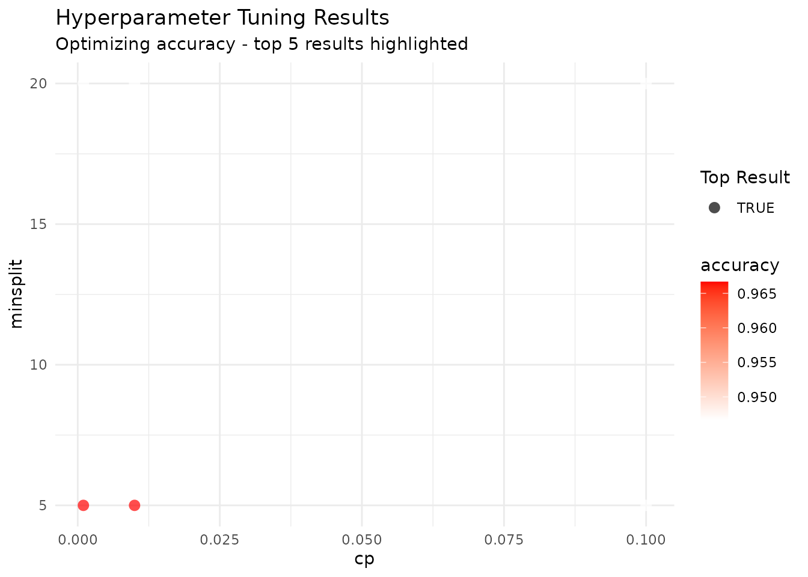
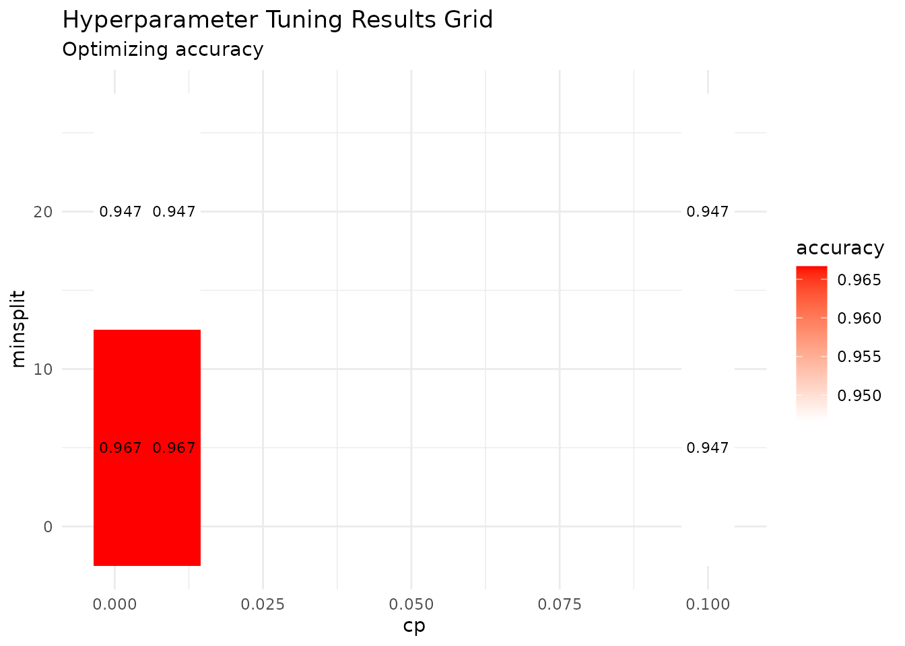
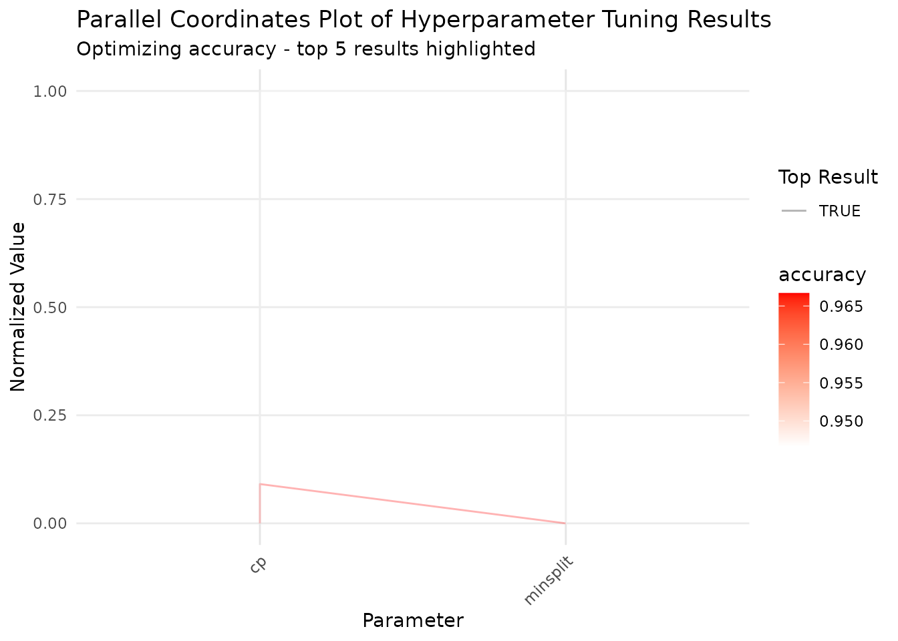
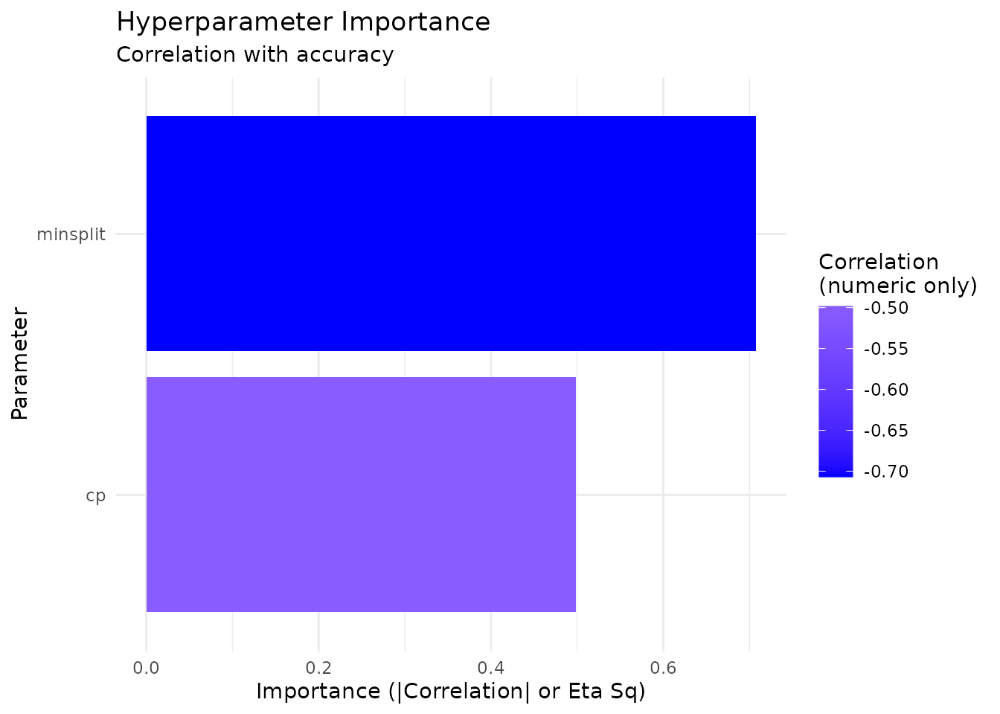

# Tuning and Pipelines

``` r

library(tidylearn)
library(dplyr)
#> 
#> Attaching package: 'dplyr'
#> The following objects are masked from 'package:stats':
#> 
#>     filter, lag
#> The following objects are masked from 'package:base':
#> 
#>     intersect, setdiff, setequal, union
```

## Overview

[`tl_model()`](https://tidylearn.sheetsolved.com/reference/tl_model.md)
fits one model with the hyperparameters you name. Two families build on
that:

- **Tuning** searches a space of hyperparameters and returns the model
  fitted with the winner.
  [`tl_tune_grid()`](https://tidylearn.sheetsolved.com/reference/tl_tune_grid.md)
  walks every combination;
  [`tl_tune_random()`](https://tidylearn.sheetsolved.com/reference/tl_tune_random.md)
  samples from ranges.
- **Pipelines** bundle preprocessing, a set of models, and an evaluation
  scheme into one object you can run, save, reload, and predict from.

The two compose: tune to find the settings, then put the winning
settings in a pipeline so the whole recipe is reproducible.

## Grid Search

[`tl_tune_grid()`](https://tidylearn.sheetsolved.com/reference/tl_tune_grid.md)
takes a named list of candidate values, one entry per hyperparameter,
and cross-validates every combination.

``` r

tuned_tree <- tl_tune_grid(
  iris, Species ~ .,
  method = "tree",
  param_grid = list(cp = c(0.001, 0.01, 0.1), minsplit = c(5, 20)),
  folds = 3,
  verbose = FALSE
)
```

What comes back is an ordinary tidylearn model, already fitted with the
winning settings, so everything you would normally do with a model still
works:

``` r

print(tuned_tree)
#> tidylearn Model
#> ===============
#> Paradigm: supervised 
#> Method: tree 
#> Task: Classification 
#> Formula: Species ~ . 
#> 
#> Training observations: 150
```

The search itself is attached as a `"tuning_results"` attribute:

``` r

tuning <- attr(tuned_tree, "tuning_results")
names(tuning)
#> [1] "param_grid"  "results"     "best_params" "best_metric" "metric"     
#> [6] "maximize"
```

``` r

tuning$results
#>   mean_metric    cp minsplit
#> 1   0.9666667 0.001        5
#> 2   0.9466667 0.001       20
#> 3   0.9666667 0.010        5
#> 4   0.9466667 0.010       20
#> 5   0.9466667 0.100        5
#> 6   0.9466667 0.100       20
```

``` r

# The settings that won, and the score they won with
tuning$best_params
#> $cp
#> [1] 0.001
#> 
#> $minsplit
#> [1] 5
tuning$best_metric
#> [1] 0.9666667
```

The winning values reach the underlying fit, not just the report:

``` r

tuned_tree$fit$control$cp
#> [1] 0.001
```

### Choosing the metric

Without a `metric`, tuning uses accuracy for classification and RMSE for
regression. Name one explicitly and the optimisation direction follows
from the metric: `rmse`, `mse`, `mae` and `mape` are minimised,
everything else maximised. Pass `maximize` only to override that.

``` r

tuned_reg <- tl_tune_grid(
  mtcars, mpg ~ .,
  method = "forest",
  param_grid = list(mtry = c(2, 4), ntree = c(100, 300)),
  folds = 3,
  metric = "rmse",
  verbose = FALSE
)

attr(tuned_reg, "tuning_results")$best_params
#> $mtry
#> [1] 4
#> 
#> $ntree
#> [1] 100
```

### Starting from a default grid

[`tl_default_param_grid()`](https://tidylearn.sheetsolved.com/reference/tl_default_param_grid.md)
supplies a reasonable starting grid per method, at three sizes. Use it
as a first pass, then narrow around whatever won.

``` r

tl_default_param_grid("tree", size = "small")
#> $cp
#> [1] 0.01 0.10
#> 
#> $minsplit
#> [1] 10 20
```

``` r

tl_default_param_grid("forest", size = "medium")
#> $mtry
#> [1] 2 3 4 5
#> 
#> $ntree
#> [1] 100 300 500
```

``` r

tuned_default <- tl_tune_grid(
  iris, Species ~ .,
  method = "tree",
  param_grid = tl_default_param_grid("tree", size = "small"),
  folds = 3,
  verbose = FALSE
)

attr(tuned_default, "tuning_results")$best_params
#> $cp
#> [1] 0.01
#> 
#> $minsplit
#> [1] 10
```

## Random Search

Grid search cost is the product of the candidate counts, so it grows
quickly.
[`tl_tune_random()`](https://tidylearn.sheetsolved.com/reference/tl_tune_random.md)
samples `n_iter` points instead.

How `param_space` describes each parameter decides how it is sampled:

| Specification              | Sampled as                         |
|----------------------------|------------------------------------|
| Two numbers, `c(lo, hi)`   | Uniform on the continuous interval |
| Three or more numbers      | Drawn from exactly those values    |
| A character vector         | Drawn from those levels            |
| A function of no arguments | Whatever the function returns      |

A two-element vector is always continuous, so `minsplit = c(2, 40)`
samples values like 11.34. For a parameter that has to be a whole
number, list the candidates instead:

``` r

tuned_random <- tl_tune_random(
  iris, Species ~ .,
  method = "tree",
  param_space = list(
    cp = c(0.0001, 0.2),                 # continuous
    minsplit = c(2, 5, 10, 20, 30, 40)   # drawn from these six
  ),
  n_iter = 8,
  folds = 3,
  seed = 42,
  verbose = FALSE
)

attr(tuned_random, "tuning_results")$best_params
#> $cp
#> [1] 0.0628054
#> 
#> $minsplit
#> [1] 40
```

Pass `seed` whenever you want the search to be reproducible. Without it,
two runs sample different points and can pick different winners.

## Looking at the Search

[`tl_plot_tuning_results()`](https://tidylearn.sheetsolved.com/reference/tl_plot_tuning_results.md)
reads the attribute and draws it four ways.

``` r

tl_plot_tuning_results(tuned_tree, plot_type = "scatter")
```



`"grid"` draws the two-parameter heat map that grid search is built for:

``` r

tl_plot_tuning_results(tuned_tree, plot_type = "grid")
```



`"parallel"` puts every parameter on its own axis, which scales past
two:

``` r

tl_plot_tuning_results(tuned_tree, plot_type = "parallel")
```



`"importance"` ranks parameters by how much of the score variation each
one explains — a quick read on which knob is worth refining:

``` r

tl_plot_tuning_results(tuned_tree, plot_type = "importance")
```



Every one of these is a ggplot2 object, so add to it as usual.

## Pipelines

A pipeline records preprocessing, the models to fit, and how to evaluate
them. Building it does no work;
[`tl_run_pipeline()`](https://tidylearn.sheetsolved.com/reference/tl_run_pipeline.md)
does.

``` r

split <- tl_split(iris, prop = 0.7, stratify = "Species", seed = 42)

pipe <- tl_pipeline(
  split$train, Species ~ .,
  preprocessing = list(standardize = TRUE, dummy_encode = FALSE),
  models = list(
    tree = list(method = "tree"),
    forest = list(method = "forest", ntree = 300)
  ),
  evaluation = list(
    validation = "cv",
    cv_folds = 3,
    metrics = c("accuracy", "f1"),
    best_metric = "accuracy"
  )
)

print(pipe)
#> Tidylearn Pipeline
#> =================
#> Formula: Species ~ . 
#> Data: 105 observations, 5 variables
#> Preprocessing: impute_missing, standardize 
#> Models: tree, forest 
#> Evaluation:  cv (3 folds)
#> Metrics: accuracy, f1 
#> Best metric: accuracy
```

Anything you leave out of `preprocessing` or `evaluation` takes its
default, so a partial list is fine. An unrecognised name is an error
rather than a step that quietly does nothing.

``` r

tl_pipeline(split$train, Species ~ .,
            preprocessing = list(scale_method = "standardize"))
#> Error:
#> ! Unknown preprocessing step(s): scale_method. Available steps: impute_missing, standardize, dummy_encode.
```

### Running it

``` r

run <- tl_run_pipeline(pipe, verbose = FALSE)

names(run$models)
#> [1] "tree"   "forest"
```

``` r

print(run)
#> Tidylearn Pipeline
#> =================
#> Formula: Species ~ . 
#> Data: 105 observations, 5 variables
#> Preprocessing: impute_missing, standardize 
#> Models: tree, forest 
#> Evaluation:  cv (3 folds)
#> Metrics: accuracy, f1 
#> Best metric: accuracy 
#> 
#> Results
#> =======
#> Best model: tree 
#> Performance:
#>   tree: accuracy = 0.9714 (best)
#>   forest: accuracy = 0.9714
```

[`tl_get_best_model()`](https://tidylearn.sheetsolved.com/reference/tl_get_best_model.md)
returns the model that won on `best_metric`:

``` r

best <- tl_get_best_model(run)
best$spec$method
#> [1] "tree"
```

### Predicting through the pipeline

This is the reason to use a pipeline rather than a bare model.
Predicting on raw new data replays the preprocessing the pipeline
learned during the run, applying the *training* centre and scale rather
than recomputing them from the new rows.

``` r

preds <- tl_predict_pipeline(run, new_data = split$test, model_name = "forest")
head(preds)
#> # A tibble: 6 × 1
#>   .pred 
#>   <fct> 
#> 1 setosa
#> 2 setosa
#> 3 setosa
#> 4 setosa
#> 5 setosa
#> 6 setosa
```

``` r

mean(preds$.pred == split$test$Species)
#> [1] 0.9333333
```

Omit `model_name` to predict with the best model.

### Saving and reloading

``` r

path <- tempfile(fileext = ".rds")
tl_save_pipeline(run, path)

reloaded <- tl_load_pipeline(path)
names(reloaded$models)
#> [1] "tree"   "forest"
```

``` r

# Predictions survive the round trip, preprocessing included
reloaded_preds <- tl_predict_pipeline(
  reloaded, new_data = split$test, model_name = "forest"
)
identical(reloaded_preds$.pred, preds$.pred)
#> [1] TRUE
```

## Tuning into a Pipeline

Tuning tells you the settings; the pipeline holds them alongside the
preprocessing that produced them.

``` r

tuned <- tl_tune_grid(
  split$train, Species ~ .,
  method = "forest",
  param_grid = list(mtry = c(2, 3), ntree = c(100, 300)),
  folds = 3,
  verbose = FALSE
)

best_params <- attr(tuned, "tuning_results")$best_params
best_params
#> $mtry
#> [1] 2
#> 
#> $ntree
#> [1] 100
```

``` r

final <- tl_pipeline(
  split$train, Species ~ .,
  models = list(
    forest = c(list(method = "forest"), best_params)
  ),
  evaluation = list(cv_folds = 3, metrics = "accuracy",
                    best_metric = "accuracy")
)

final_run <- tl_run_pipeline(final, verbose = FALSE)
final_preds <- tl_predict_pipeline(final_run, new_data = split$test)

mean(final_preds$.pred == split$test$Species)
#> [1] 0.9333333
```

## Cost

Tuning multiplies fits. A grid of *g* combinations at *k* folds is *g ×
k* fits, plus one more to build the final model. The tree grid at the
top of this vignette is 6 combinations × 3 folds = 18 fits, 19 with the
final model, of a method that takes milliseconds. The same grid on
`method = "xgboost"` with 1000 rounds is the same 19 fits of something
much slower.

Two levers, in the order worth pulling:

1.  **Fewer folds.** Going from 5 to 3 removes 40% of the work and still
    gives out-of-sample estimates.
2.  **Random over grid.** `tl_tune_random(n_iter = 10)` costs a fixed 10
    points regardless of how many parameters you are searching, where a
    grid over the same parameters costs their product.

[`tl_compute_advisor()`](https://tidylearn.sheetsolved.com/reference/tl_compute_advisor.md)
estimates the cost of a single fit before you multiply it by the search
— worth a look before starting a long grid.

## Where to Go Next

- **AutoML**
  ([`vignette("automl")`](https://tidylearn.sheetsolved.com/articles/automl.md))
  searches across methods rather than within one, and manages its own
  budget.
- **Diagnostics**
  ([`vignette("diagnostics")`](https://tidylearn.sheetsolved.com/articles/diagnostics.md))
  covers what to check once you have a fitted model.
