# Unsupervised Learning with tidylearn

``` r

library(tidylearn)
library(dplyr)
#> 
#> Attaching package: 'dplyr'
#> The following objects are masked from 'package:stats':
#> 
#>     filter, lag
#> The following objects are masked from 'package:base':
#> 
#>     intersect, setdiff, setequal, union
library(ggplot2)
```

## Two Ways In

tidylearn offers two entry points to the same algorithms, and which one
you want depends on what you are doing.

`tl_model(method = "kmeans")` puts clustering behind the same signature
as every supervised method, which is what you want when the clustering
is a step inside a larger workflow — see
[`vignette("integration-workflows")`](https://tidylearn.sheetsolved.com/articles/integration-workflows.md).

The `tidy_*()` family is the fuller interface, and the subject of this
vignette. Each function returns a list of tibbles rather than a fitted
object you have to take apart, and each has a matching `augment_*()`
that glues the result back onto your data.

``` r

# Same algorithm, two interfaces
model <- tl_model(iris[, 1:4], method = "kmeans", k = 3)
km <- tidy_kmeans(iris[, 1:4], k = 3)

names(km)
#> [1] "clusters" "centers"  "metrics"  "sizes"    "model"
```

Both wrap [`stats::kmeans()`](https://rdrr.io/r/stats/kmeans.html); the
algorithms are unchanged. Reach the raw object through `model$fit$model`
or `km$model` — an unsupervised `$fit` is the list of tidied components,
with the wrapped object among them.

**Wrapped packages:**

- stats ([`prcomp()`](https://rdrr.io/r/stats/prcomp.html),
  [`kmeans()`](https://rdrr.io/r/stats/kmeans.html),
  [`hclust()`](https://rdrr.io/r/stats/hclust.html),
  [`cmdscale()`](https://rdrr.io/r/stats/cmdscale.html))
- cluster (`pam()`, `clara()`)
- dbscan for density-based clustering
- MASS (`isoMDS()`, `sammon()`)
- smacof for MDS algorithms
- arules for association rules — see
  [`vignette("market-basket")`](https://tidylearn.sheetsolved.com/articles/market-basket.md)

## Scale First

Every distance-based method here answers a question about distance, and
distance is measured in whatever units your columns happen to use. A
variable measured in thousands will dominate one measured in tenths,
whatever its actual relevance.

[`standardize_data()`](https://tidylearn.sheetsolved.com/reference/standardize_data.md)
centres and scales:

``` r

iris_scaled <- standardize_data(iris[, 1:4])

sapply(iris_scaled, function(x) round(c(mean = mean(x), sd = sd(x)), 3))
#>      Sepal.Length Sepal.Width Petal.Length Petal.Width
#> mean            0           0            0           0
#> sd              1           1            1           1
```

iris happens to have four variables on a similar scale, so the examples
below use the raw values and stay comparable to the species labels. On
real data, scale first.

## Principal Component Analysis

``` r

pca <- tidy_pca(iris[, 1:4], scale = TRUE)
names(pca)
#> [1] "scores"   "loadings" "variance" "model"    "settings"
```

Accessors rather than list-digging:

``` r

get_pca_variance(pca)
#> # A tibble: 4 × 5
#>   component  sdev variance prop_variance cum_variance
#>   <chr>     <dbl>    <dbl>         <dbl>        <dbl>
#> 1 PC1       1.71    2.92         0.730          0.730
#> 2 PC2       0.956   0.914        0.229          0.958
#> 3 PC3       0.383   0.147        0.0367         0.995
#> 4 PC4       0.144   0.0207       0.00518        1
```

``` r

get_pca_loadings(pca, n_components = 2)
#> # A tibble: 4 × 3
#>   variable        PC1     PC2
#>   <chr>         <dbl>   <dbl>
#> 1 Sepal.Length  0.521 -0.377 
#> 2 Sepal.Width  -0.269 -0.923 
#> 3 Petal.Length  0.580 -0.0245
#> 4 Petal.Width   0.565 -0.0669
```

Two components carry 96% of the variance.
[`plot_variance_explained()`](https://tidylearn.sheetsolved.com/reference/plot_variance_explained.md)
marks where a threshold is crossed:

``` r

plot_variance_explained(get_pca_variance(pca), threshold = 0.9)
```

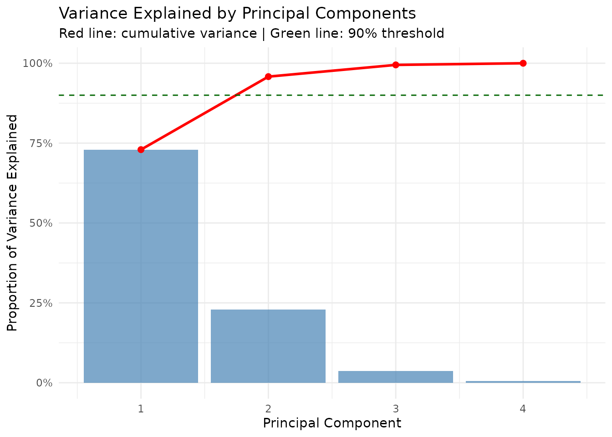

[`tidy_pca_screeplot()`](https://tidylearn.sheetsolved.com/reference/tidy_pca_screeplot.md)
is the conventional scree plot:

``` r

tidy_pca_screeplot(pca)
```

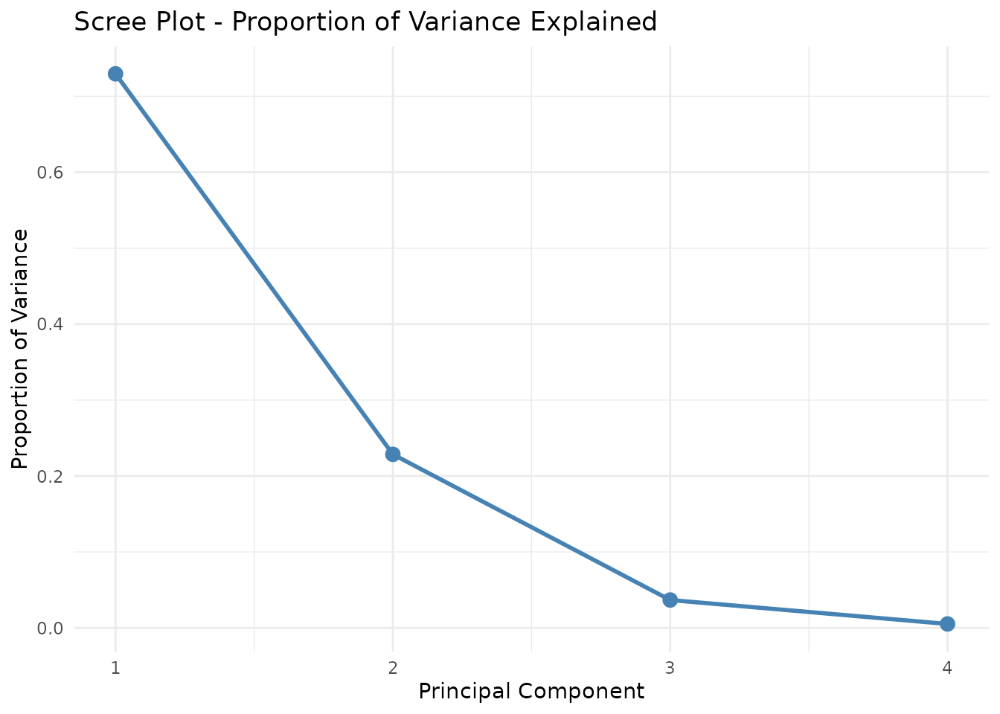

### Scores back on the data

[`augment_pca()`](https://tidylearn.sheetsolved.com/reference/augment_pca.md)
returns the original data with component scores appended, so the labels
you already have stay attached:

``` r

scored <- augment_pca(pca, iris, n_components = 2)
head(scored, 3)
#>   Sepal.Length Sepal.Width Petal.Length Petal.Width Species       PC1
#> 1          5.1         3.5          1.4         0.2  setosa -2.257141
#> 2          4.9         3.0          1.4         0.2  setosa -2.074013
#> 3          4.7         3.2          1.3         0.2  setosa -2.356335
#>          PC2
#> 1 -0.4784238
#> 2  0.6718827
#> 3  0.3407664
```

``` r

ggplot(scored, aes(x = PC1, y = PC2, color = Species)) +
  geom_point(size = 3, alpha = 0.7) +
  labs(
    title = "PCA of Iris",
    x = paste0("PC1 (",
               round(get_pca_variance(pca)$prop_variance[1] * 100, 1), "%)"),
    y = paste0("PC2 (",
               round(get_pca_variance(pca)$prop_variance[2] * 100, 1), "%)")
  ) +
  theme_minimal()
```

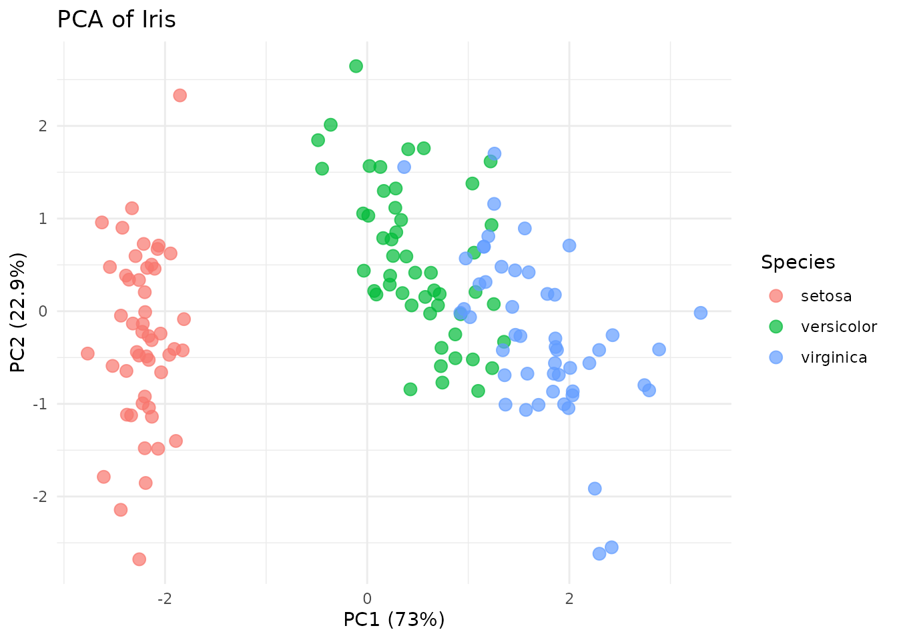

[`tidy_pca_biplot()`](https://tidylearn.sheetsolved.com/reference/tidy_pca_biplot.md)
overlays the loadings on the same scatter, which is how you read what
the components mean:

``` r

tidy_pca_biplot(pca, color_by = iris$Species)
```

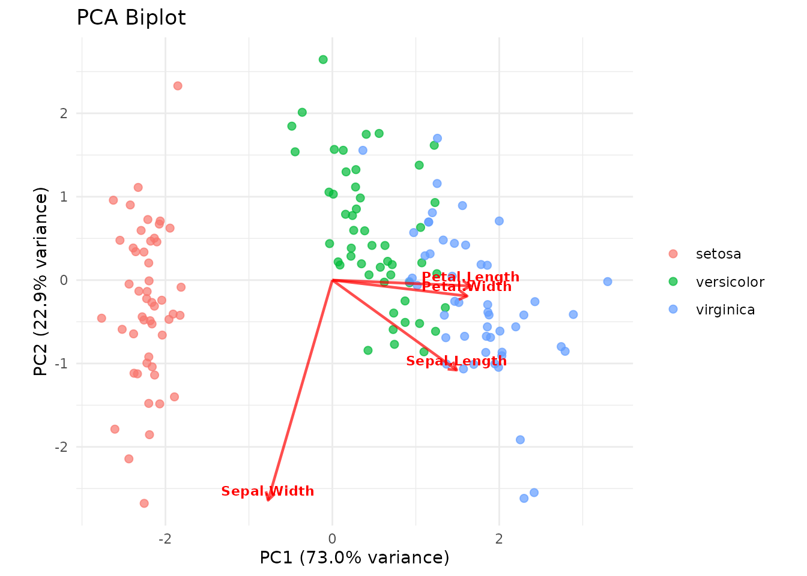

## How Many Clusters?

Guessing *k* and checking the answer against labels you happen to have
is not a method.
[`optimal_clusters()`](https://tidylearn.sheetsolved.com/reference/optimal_clusters.md)
runs three criteria at once.

``` r

opt <- optimal_clusters(iris[, 1:4], max_k = 8)
names(opt)
#> [1] "wss"        "silhouette" "gap"
```

``` r

opt$wss
#> # A tibble: 8 × 2
#>       k tot_withinss
#>   <int>        <dbl>
#> 1     1        681. 
#> 2     2        152. 
#> 3     3         78.9
#> 4     4         57.2
#> 5     5         46.4
#> 6     6         39.0
#> 7     7         34.3
#> 8     8         30.0
```

``` r

opt$silhouette
#> # A tibble: 7 × 2
#>       k avg_sil_width
#>   <int>         <dbl>
#> 1     2         0.681
#> 2     3         0.553
#> 3     4         0.498
#> 4     5         0.489
#> 5     6         0.365
#> 6     7         0.359
#> 7     8         0.352
```

``` r

c(silhouette = attr(opt$silhouette, "optimal_k"),
  gap = opt$gap$recommended_k)
#> silhouette        gap 
#>          2          6
```

The three criteria disagree, which is normal. The elbow is a judgement
call, silhouette favours well-separated compact clusters, and the gap
statistic compares against a null of no structure. Silhouette says 2
here because *versicolor* and *virginica* overlap; the botanical answer
is 3.

``` r

plot_elbow(opt$wss, suggested_k = 3)
```

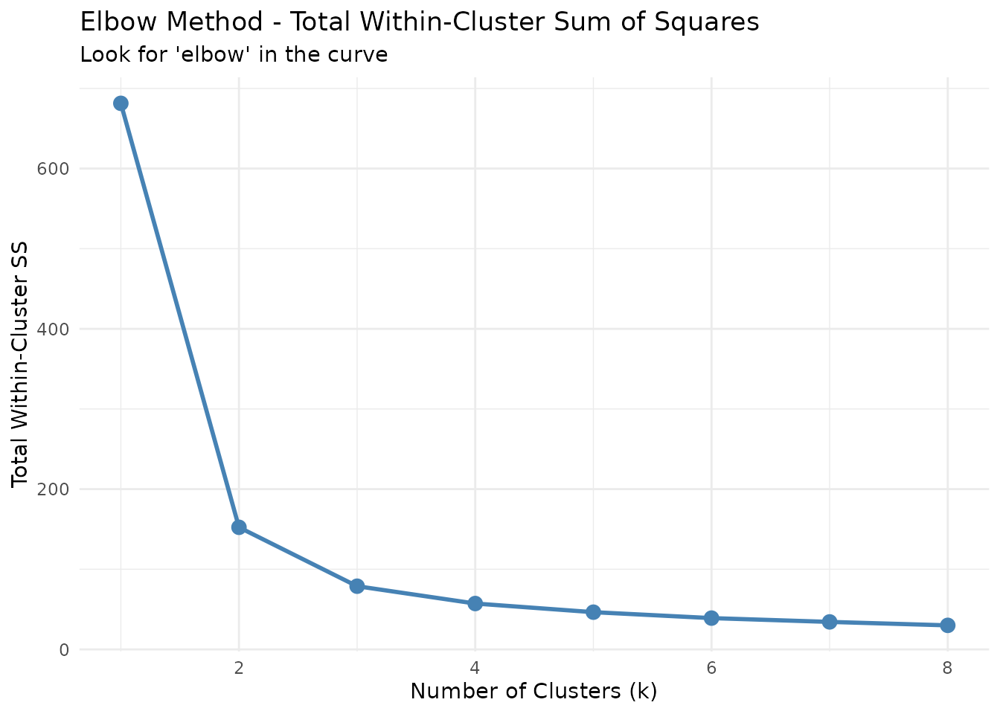

``` r

plot_gap_stat(opt$gap)
```

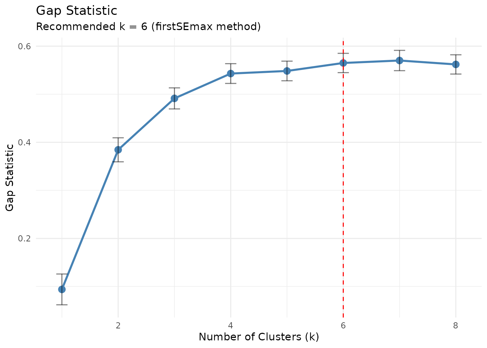

[`calc_wss()`](https://tidylearn.sheetsolved.com/reference/calc_wss.md)
gives the within-cluster sums of squares on their own if that is all you
need:

``` r

calc_wss(iris[, 1:4], max_k = 6)
#> # A tibble: 6 × 2
#>       k tot_withinss
#>   <int>        <dbl>
#> 1     1        681. 
#> 2     2        152. 
#> 3     3         78.9
#> 4     4         57.2
#> 5     5         46.4
#> 6     6         39.0
```

## K-means

``` r

km <- tidy_kmeans(iris[, 1:4], k = 3)
km$centers
#> # A tibble: 3 × 5
#>   cluster Sepal.Length Sepal.Width Petal.Length Petal.Width
#>     <int>        <dbl>       <dbl>        <dbl>       <dbl>
#> 1       1         5.90        2.75         4.39       1.43 
#> 2       2         6.85        3.07         5.74       2.07 
#> 3       3         5.01        3.43         1.46       0.246
```

``` r

km$clusters
#> # A tibble: 150 × 2
#>    .obs_id cluster
#>    <chr>     <int>
#>  1 1             3
#>  2 2             3
#>  3 3             3
#>  4 4             3
#>  5 5             3
#>  6 6             3
#>  7 7             3
#>  8 8             3
#>  9 9             3
#> 10 10            3
#> # ℹ 140 more rows
```

[`augment_kmeans()`](https://tidylearn.sheetsolved.com/reference/augment_kmeans.md)
puts the assignment back on the data:

``` r

iris_clustered <- augment_kmeans(km, iris)
table(Cluster = iris_clustered$cluster, Species = iris_clustered$Species)
#>        Species
#> Cluster setosa versicolor virginica
#>       1      0         48        14
#>       2      0          2        36
#>       3     50          0         0
```

``` r

plot_cluster_sizes(km$clusters$cluster)
```

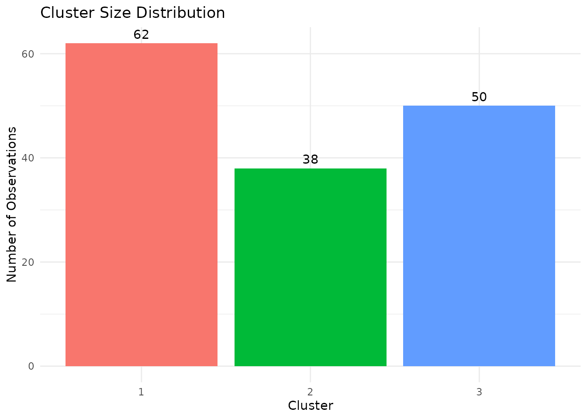

``` r

plot_clusters(iris_clustered, cluster_col = "cluster",
              x_col = "Petal.Length", y_col = "Petal.Width")
```

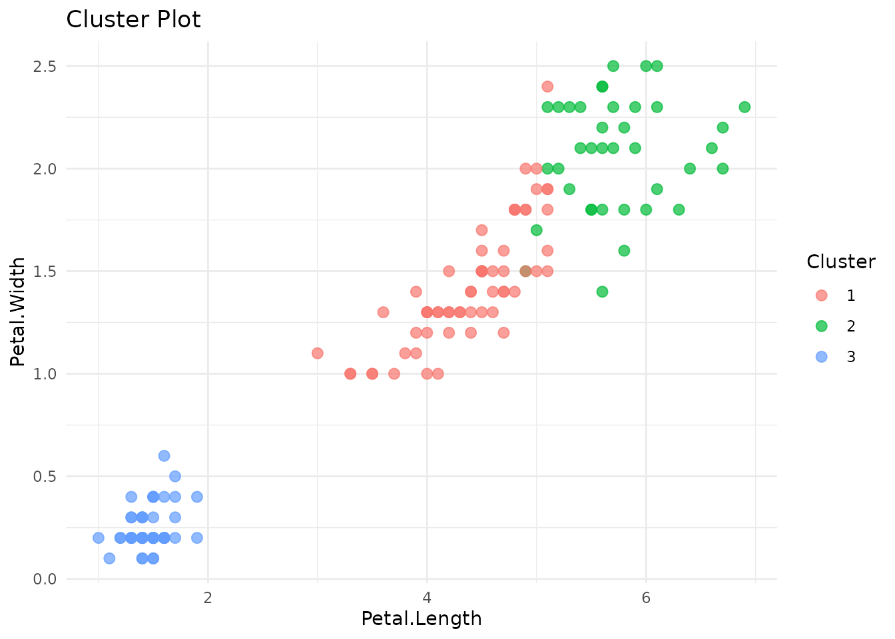

### Was it a good clustering?

Silhouette width scores each observation on how much better it fits its
own cluster than the next-nearest one. Values near 1 are comfortable,
near 0 borderline, negative means the point is on the wrong side.

``` r

dist_mat <- tidy_dist(iris[, 1:4])
sil <- tidy_silhouette(km$clusters$cluster, dist_mat)

sil$avg_width
#> [1] 0.552819
```

``` r

sil$cluster_avg
#> # A tibble: 3 × 3
#>   cluster     n avg_sil_width
#>     <dbl> <int>         <dbl>
#> 1       1    62         0.417
#> 2       2    38         0.451
#> 3       3    50         0.798
```

``` r

plot_silhouette(sil)
```

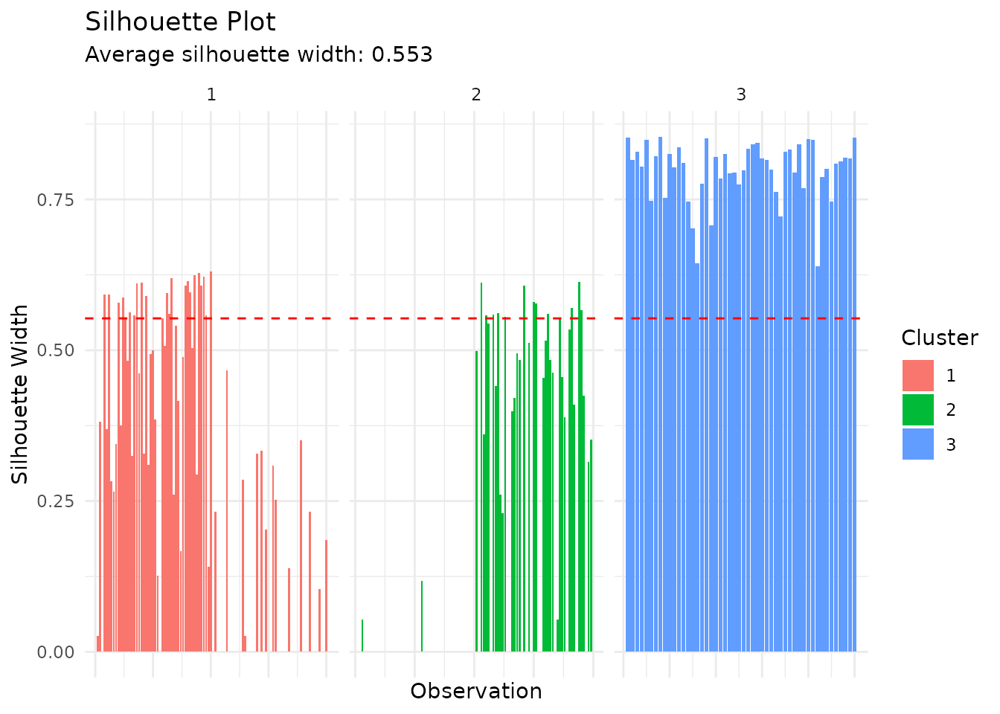

Cluster 1 is clean; the other two are the *versicolor*/*virginica*
boundary, and their scores say so without needing the labels.

[`calc_validation_metrics()`](https://tidylearn.sheetsolved.com/reference/calc_validation_metrics.md)
collects the summary numbers in one row:

``` r

calc_validation_metrics(km$clusters$cluster, iris[, 1:4], dist_mat)
#> # A tibble: 1 × 7
#>       k min_size max_size avg_size avg_silhouette min_silhouette total_wss
#>   <int>    <int>    <int>    <dbl>          <dbl>          <dbl>     <dbl>
#> 1     3       38       62       50          0.553         0.0264      78.9
```

## PAM and CLARA

PAM picks actual observations as cluster centres, which makes it less
sensitive to outliers than k-means and gives you a representative row
rather than an average.

``` r

pam_result <- tidy_pam(iris[, 1:4], k = 3)
pam_result$medoids
#> # A tibble: 3 × 6
#>   cluster medoid_index Sepal.Length Sepal.Width Petal.Length Petal.Width
#>     <int>        <int>        <dbl>       <dbl>        <dbl>       <dbl>
#> 1       1            8          5           3.4          1.5         0.2
#> 2       2           79          6           2.9          4.5         1.5
#> 3       3          113          6.8         3            5.5         2.1
```

``` r

pam_result$silhouette_avg
#> [1] 0.552819
```

``` r

table(Cluster = augment_pam(pam_result, iris)$cluster, Species = iris$Species)
#>        Species
#> Cluster setosa versicolor virginica
#>       1     50          0         0
#>       2      0         48        14
#>       3      0          2        36
```

CLARA samples rather than computing the full distance matrix, which is
what makes it usable when *n* is large enough that an *n × n* matrix is
not:

``` r

large_data <- iris[rep(seq_len(nrow(iris)), 10), 1:4]
clara_result <- tidy_clara(large_data, k = 3, samples = 5)

table(clara_result$clusters$cluster)
#> 
#>   1   2   3 
#> 500 380 620
```

## Hierarchical Clustering

[`tidy_hclust()`](https://tidylearn.sheetsolved.com/reference/tidy_hclust.md)
builds the tree; cutting it is a separate decision.

``` r

hc <- tidy_hclust(iris[, 1:4], method = "average")
plot_dendrogram(hc, k = 3)
```

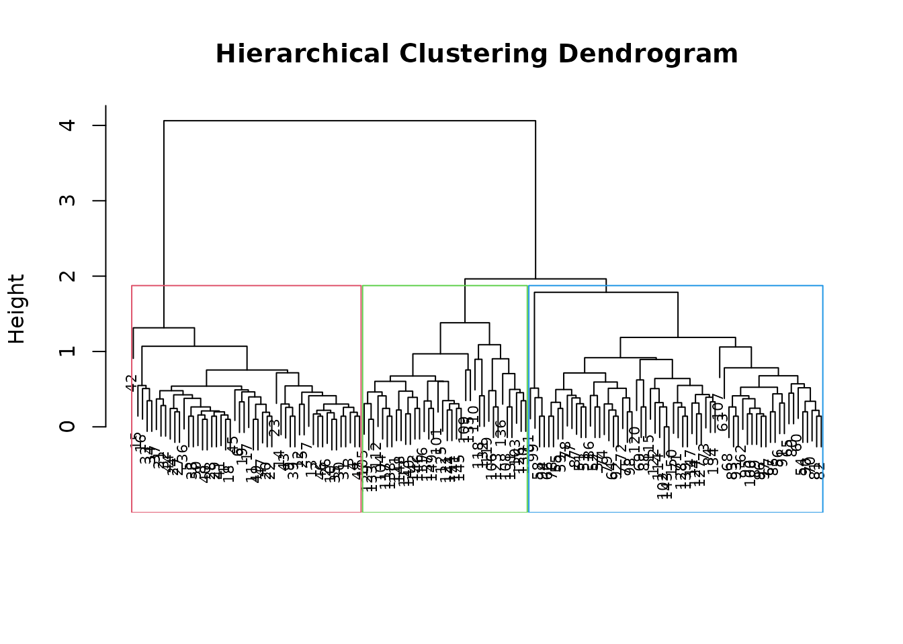

[`optimal_hclust_k()`](https://tidylearn.sheetsolved.com/reference/optimal_hclust_k.md)
scores cut heights the way
[`optimal_clusters()`](https://tidylearn.sheetsolved.com/reference/optimal_clusters.md)
scores *k*:

``` r

optimal_hclust_k(hc, method = "silhouette", max_k = 8)$optimal_k
#> [1] 2
```

``` r

cuts <- tidy_cutree(hc, k = 3)
head(cuts, 3)
#> # A tibble: 3 × 2
#>   .obs_id cluster
#>   <chr>     <int>
#> 1 1             1
#> 2 2             1
#> 3 3             1
```

``` r

hc_data <- augment_hclust(hc, iris, k = 3)
table(Cluster = hc_data$cluster, Species = hc_data$Species)
#>        Species
#> Cluster setosa versicolor virginica
#>       1     50          0         0
#>       2      0         50        14
#>       3      0          0        36
```

Linkage matters more than most people expect. `"average"`, `"complete"`,
`"single"` and `"ward.D2"` can produce different trees from the same
distances:

``` r

linkages <- c("single", "average", "complete", "ward.D2")

sapply(linkages, function(m) {
  cl <- tidy_cutree(tidy_hclust(iris[, 1:4], method = m), k = 3)$cluster
  max(table(cl))
})
#>   single  average complete  ward.D2 
#>       98       64       72       64
```

Single linkage chains, so it puts almost everything in one cluster. That
is a property of the linkage, not a finding about irises.

## DBSCAN

DBSCAN finds arbitrarily shaped clusters and labels sparse points as
noise. It needs `eps` (the neighbourhood radius) and `minPts`. Rather
than guessing,
[`suggest_eps()`](https://tidylearn.sheetsolved.com/reference/suggest_eps.md)
reads it off the k-nearest-neighbour distance curve.

``` r

eps_suggestion <- suggest_eps(iris[, 1:4], minPts = 5)
eps_suggestion$eps
#> [1] 0.75757
```

``` r

plot_knn_dist(iris[, 1:4], k = 5)
```

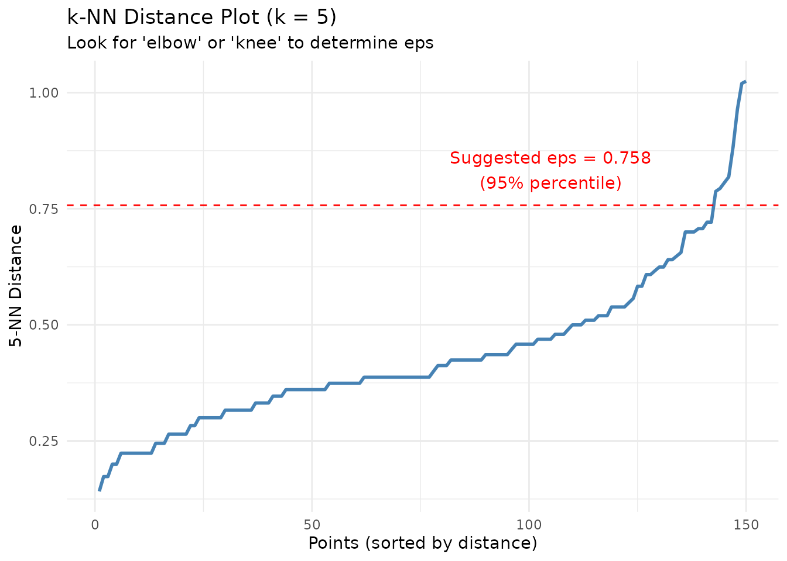

The elbow in that curve is where points stop having close neighbours,
which is the radius you want.

``` r

db <- tidy_dbscan(iris[, 1:4], eps = eps_suggestion$eps, minPts = 5)

c(clusters = db$n_clusters, noise = db$n_noise)
#> clusters    noise 
#>        2        2
```

``` r

db_data <- augment_dbscan(db, iris)
table(Cluster = db_data$cluster, Species = db_data$Species)
#>        Species
#> Cluster setosa versicolor virginica
#>       0      0          0         2
#>       1     50          0         0
#>       2      0         50        48
```

Cluster 0 is noise, not a cluster.

[`explore_dbscan_params()`](https://tidylearn.sheetsolved.com/reference/explore_dbscan_params.md)
sweeps the two parameters together, which is more informative than
tuning either alone:

``` r

explore_dbscan_params(
  iris[, 1:4],
  eps_values = c(0.4, 0.6, 0.8, 1.0),
  minPts_values = c(4, 5, 10)
)
#> # A tibble: 12 × 5
#>      eps minPts n_clusters n_noise prop_noise
#>    <dbl>  <dbl>      <int>   <int>      <dbl>
#>  1   0.4      4          4      25     0.167 
#>  2   0.6      4          3       5     0.0333
#>  3   0.8      4          2       2     0.0133
#>  4   1        4          2       0     0     
#>  5   0.4      5          4      32     0.213 
#>  6   0.6      5          2       9     0.06  
#>  7   0.8      5          2       2     0.0133
#>  8   1        5          2       0     0     
#>  9   0.4     10          3      83     0.553 
#> 10   0.6     10          2      13     0.0867
#> 11   0.8     10          2       5     0.0333
#> 12   1       10          2       0     0
```

Read `prop_noise` alongside `n_clusters`: a setting that finds many
clusters by discarding a third of the data has not found structure.

## Multidimensional Scaling

MDS places observations so that their plotted distances reproduce their
distances in the original space. Unlike PCA it can work from any
distance matrix, including non-Euclidean ones.

``` r

mds <- tidy_mds(iris[, 1:4], method = "classical", ndim = 2)
head(mds$config, 3)
#> # A tibble: 3 × 2
#>    Dim1   Dim2
#>   <dbl>  <dbl>
#> 1 -2.68  0.319
#> 2 -2.71 -0.177
#> 3 -2.89 -0.145
```

``` r

plot_mds(mds, color_by = iris$Species, label_points = FALSE)
```

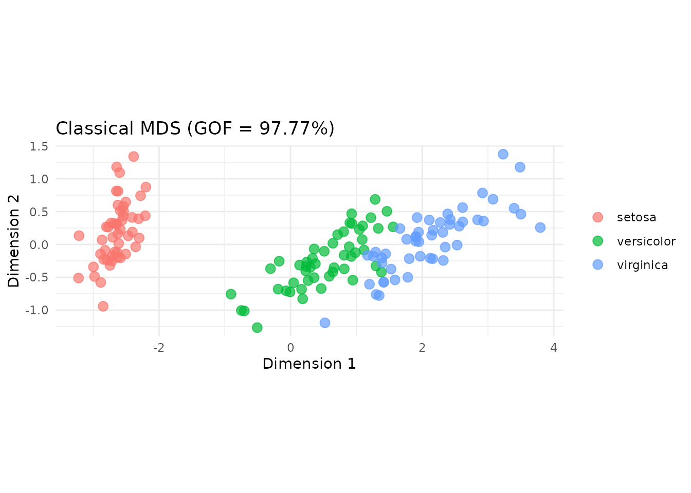

`method` also takes `"metric"` and `"nonmetric"` (both via smacof),
`"sammon"` and `"kruskal"`. The last two minimise a stress function by
dividing through the observed distances, so they need every pairwise
distance to be strictly positive. iris contains one duplicated row,
which is enough to stop them:

``` r

tidy_mds(iris[, 1:4], method = "sammon", ndim = 2)
#> Error:
#> ! method = "sammon" needs every pairwise distance to be positive, but 1 pair(s) of observations are identical: 102 and 143. Drop the duplicates, or use method = "classical", "metric" or "nonmetric", which tolerate them.
```

Drop the duplicates and they run:

``` r

distinct_iris <- iris[!duplicated(iris[, 1:4]), 1:4]
sammon <- tidy_mds(distinct_iris, method = "sammon", ndim = 2)
sammon$stress
#> [1] 0.004015053
```

Stress is the number to check before reading anything into a non-metric
layout: below about 0.05 the picture is a faithful rendering of the
distances, and above about 0.2 it is decoration.

## Comparing Clusterings

[`compare_clusterings()`](https://tidylearn.sheetsolved.com/reference/compare_clusterings.md)
scores several partitions of the same data side by side.

``` r

comparison <- compare_clusterings(
  list(
    kmeans = km$clusters$cluster,
    pam = pam_result$clusters$cluster,
    hclust = cuts$cluster,
    dbscan = db$clusters$cluster
  ),
  iris[, 1:4],
  dist_mat
)

comparison
#> # A tibble: 4 × 8
#>   method     k min_size max_size avg_size avg_silhouette min_silhouette
#>   <chr>  <int>    <int>    <int>    <dbl>          <dbl>          <dbl>
#> 1 kmeans     3       38       62       50          0.553         0.0264
#> 2 pam        3       38       62       50          0.553         0.0264
#> 3 hclust     3       36       64       50          0.554        -0.0901
#> 4 dbscan     2        2       98       50          0.512        -0.639 
#> # ℹ 1 more variable: total_wss <dbl>
```

``` r

plot_cluster_comparison(
  iris[, 1:4] %>%
    mutate(kmeans = km$clusters$cluster, hclust = cuts$cluster),
  cluster_cols = c("kmeans", "hclust"),
  x_col = "Petal.Length",
  y_col = "Petal.Width"
)
```

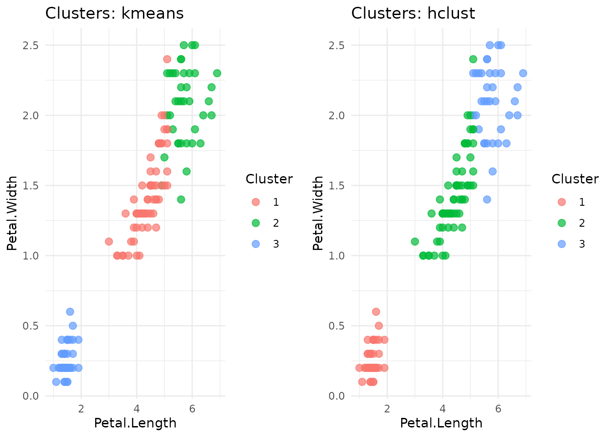

The distance metric is a choice too.
[`compare_distances()`](https://tidylearn.sheetsolved.com/reference/compare_distances.md)
computes several so you can see whether your conclusion depends on it:

``` r

names(compare_distances(iris[, 1:4]))
#> [1] "euclidean" "manhattan" "maximum"
```

``` r

plot_distance_heatmap(dist_mat)
```

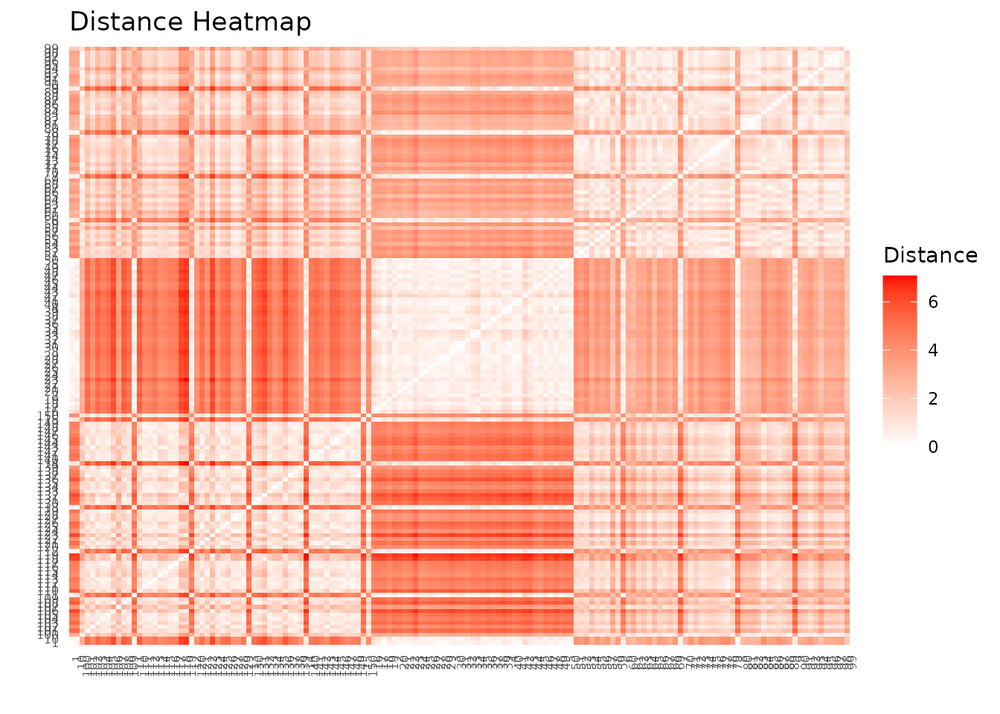

Look for block structure on the diagonal — contiguous runs of small
distances are what a cluster looks like here.

## A Worked Sequence

Putting the pieces in the order they belong:

``` r

data_matrix <- standardize_data(iris[, 1:4])

# 1. How many clusters does the data support?
choice <- optimal_clusters(data_matrix, max_k = 8)
k <- attr(choice$silhouette, "optimal_k")
k
#> [1] 2
```

``` r

# 2. Cluster at that k
final_km <- tidy_kmeans(data_matrix, k = k)

# 3. Score the result before believing it
final_sil <- tidy_silhouette(final_km$clusters$cluster, tidy_dist(data_matrix))
final_sil$avg_width
#> [1] 0.58175
```

``` r

# 4. Attach the assignment and look at it
final_data <- augment_kmeans(final_km, iris)
table(Cluster = final_data$cluster, Species = final_data$Species)
#>        Species
#> Cluster setosa versicolor virginica
#>       1     50          0         0
#>       2      0         50        50
```

``` r

plot_clusters(final_data, cluster_col = "cluster",
              x_col = "Petal.Length", y_col = "Petal.Width")
```

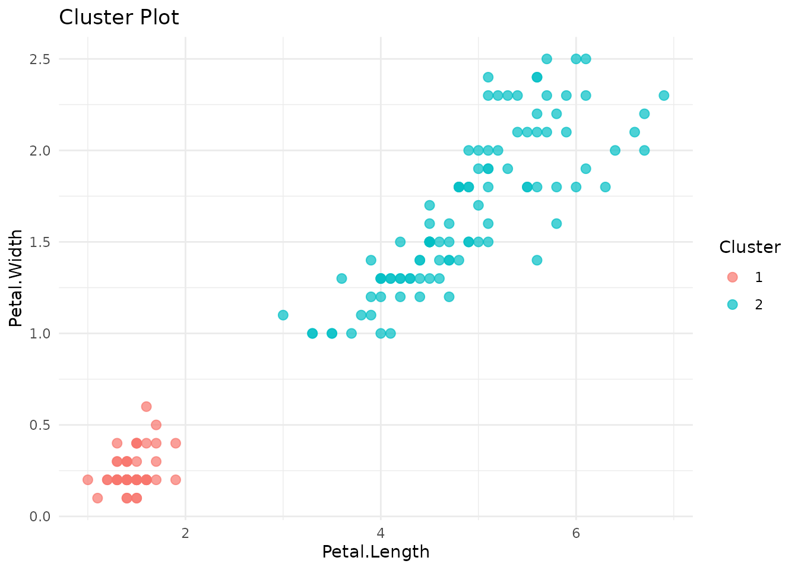

Silhouette chose 2, and the table shows what that means: *setosa*
separated, the other two species merged. That is the honest reading of
this data at this metric — the third cluster exists botanically but is
not well separated in these four measurements.

## Function Reference

| Task | Function |
|----|----|
| Prepare | [`standardize_data()`](https://tidylearn.sheetsolved.com/reference/standardize_data.md), [`tidy_dist()`](https://tidylearn.sheetsolved.com/reference/tidy_dist.md), [`compare_distances()`](https://tidylearn.sheetsolved.com/reference/compare_distances.md) |
| Choose *k* | [`optimal_clusters()`](https://tidylearn.sheetsolved.com/reference/optimal_clusters.md), [`calc_wss()`](https://tidylearn.sheetsolved.com/reference/calc_wss.md), [`tidy_gap_stat()`](https://tidylearn.sheetsolved.com/reference/tidy_gap_stat.md), [`optimal_hclust_k()`](https://tidylearn.sheetsolved.com/reference/optimal_hclust_k.md) |
| Reduce | [`tidy_pca()`](https://tidylearn.sheetsolved.com/reference/tidy_pca.md), [`tidy_mds()`](https://tidylearn.sheetsolved.com/reference/tidy_mds.md) |
| Cluster | [`tidy_kmeans()`](https://tidylearn.sheetsolved.com/reference/tidy_kmeans.md), [`tidy_pam()`](https://tidylearn.sheetsolved.com/reference/tidy_pam.md), [`tidy_clara()`](https://tidylearn.sheetsolved.com/reference/tidy_clara.md), [`tidy_hclust()`](https://tidylearn.sheetsolved.com/reference/tidy_hclust.md), [`tidy_dbscan()`](https://tidylearn.sheetsolved.com/reference/tidy_dbscan.md) |
| Attach results | [`augment_pca()`](https://tidylearn.sheetsolved.com/reference/augment_pca.md), [`augment_kmeans()`](https://tidylearn.sheetsolved.com/reference/augment_kmeans.md), [`augment_pam()`](https://tidylearn.sheetsolved.com/reference/augment_pam.md), [`augment_hclust()`](https://tidylearn.sheetsolved.com/reference/augment_hclust.md), [`augment_dbscan()`](https://tidylearn.sheetsolved.com/reference/augment_dbscan.md) |
| Validate | [`tidy_silhouette()`](https://tidylearn.sheetsolved.com/reference/tidy_silhouette.md), [`calc_validation_metrics()`](https://tidylearn.sheetsolved.com/reference/calc_validation_metrics.md), [`compare_clusterings()`](https://tidylearn.sheetsolved.com/reference/compare_clusterings.md) |
| Tune DBSCAN | [`suggest_eps()`](https://tidylearn.sheetsolved.com/reference/suggest_eps.md), [`plot_knn_dist()`](https://tidylearn.sheetsolved.com/reference/plot_knn_dist.md), [`explore_dbscan_params()`](https://tidylearn.sheetsolved.com/reference/explore_dbscan_params.md) |
| Plot | [`plot_elbow()`](https://tidylearn.sheetsolved.com/reference/plot_elbow.md), [`plot_silhouette()`](https://tidylearn.sheetsolved.com/reference/plot_silhouette.md), [`plot_gap_stat()`](https://tidylearn.sheetsolved.com/reference/plot_gap_stat.md), [`plot_clusters()`](https://tidylearn.sheetsolved.com/reference/plot_clusters.md), [`plot_cluster_sizes()`](https://tidylearn.sheetsolved.com/reference/plot_cluster_sizes.md), [`plot_dendrogram()`](https://tidylearn.sheetsolved.com/reference/plot_dendrogram.md), [`plot_mds()`](https://tidylearn.sheetsolved.com/reference/plot_mds.md), [`plot_distance_heatmap()`](https://tidylearn.sheetsolved.com/reference/plot_distance_heatmap.md), [`plot_variance_explained()`](https://tidylearn.sheetsolved.com/reference/plot_variance_explained.md) |
| Accessors | [`get_pca_variance()`](https://tidylearn.sheetsolved.com/reference/get_pca_variance.md), [`get_pca_loadings()`](https://tidylearn.sheetsolved.com/reference/get_pca_loadings.md), [`tidy_cutree()`](https://tidylearn.sheetsolved.com/reference/tidy_cutree.md) |

Association rules have their own vignette:
[`vignette("market-basket")`](https://tidylearn.sheetsolved.com/articles/market-basket.md).
